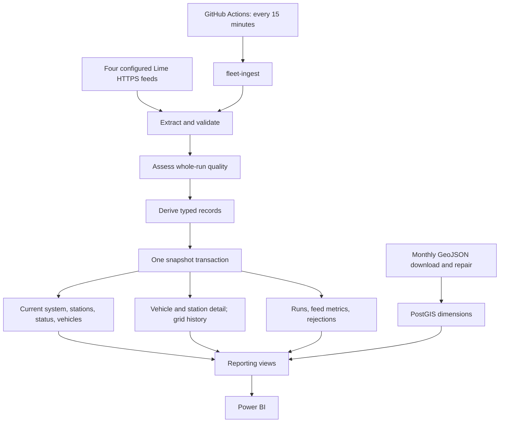
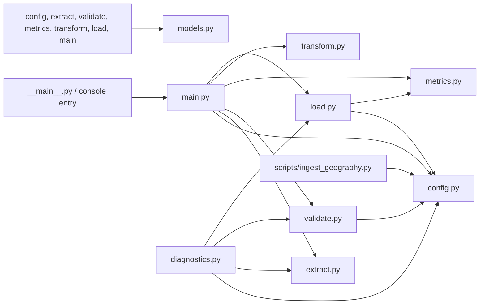
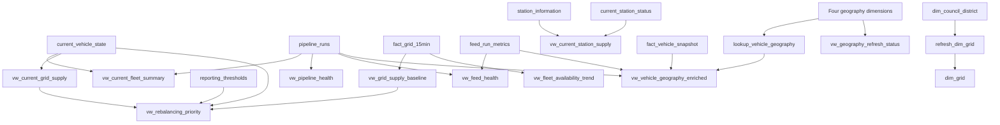

# Real-Time Fleet Operations Intelligence: Analyst Onboarding

This repository turns four Lime Seattle availability feeds into validated PostgreSQL data and reporting views for Power BI. It schedules an observation every 15 minutes and refreshes Seattle boundary data monthly. Its purpose is to explain **observed fleet supply, availability, geography, and pipeline health**.

This guide is for a Data Analyst who knows basic spreadsheets or SQL and wants to understand, investigate, and eventually change the whole pipeline. You do not need to know Python beforehand. The explanations introduce concepts first; the file catalog and change handbook provide engineering detail when needed.

The source and migrations define behavior. This guide describes package `1.1.0`, migrations 001–009, and all 49 tracked files in this checkout. Recorded geography verification is historical evidence, not a live health check. Worked examples are synthetic. No production database or feed was accessed to prepare this guide.

## Contents

1. [How to use this guide](#how-to-use-this-guide)
2. [First principles](#first-principles)
3. [The system and its dependencies](#the-system-and-its-dependencies)
4. [One observation from JSON to dashboard](#one-observation-from-json-to-dashboard)
5. [Quality, transactions, and failure behavior](#quality-transactions-and-failure-behavior)
6. [Every tracked file](#every-tracked-file)
7. [Database dictionary](#database-dictionary)
8. [Reporting views and analytical rules](#reporting-views-and-analytical-rules)
9. [Local setup and configuration](#local-setup-and-configuration)
10. [Read-only analyst queries](#read-only-analyst-queries)
11. [Changing SQL and the pipeline](#changing-sql-and-the-pipeline)
12. [Worked change walkthroughs](#worked-change-walkthroughs)
13. [Testing, deployment, and rollback](#testing-deployment-and-rollback)
14. [Troubleshooting and frequently asked questions](#troubleshooting-and-frequently-asked-questions)
15. [Known limitations and documentation maintenance](#known-limitations-and-documentation-maintenance)

## How to use this guide

| Your task | Read first | Learning outcome |
|---|---|---|
| First day | First principles, diagrams, worked observation | Explain what one row means, where it comes from, and what it cannot prove. |
| First analysis | Database dictionary, reporting rules, queries | Choose a view and time filter without inflating counts. |
| First local run | Setup, configuration, quality behavior | Distinguish commands that read data from commands that write it. |
| First change | Change handbook, walkthroughs, testing/deployment | Identify definitions, mappings, permissions, and tests that must move together. |
| An incident | Troubleshooting, then the relevant file entry | Trace a dashboard symptom back to a source or run. |

A clone contains code, not production data or credentials. Obtain reporting access and connection details from the deployment owner. Normal analysis needs read access; testing writes belongs in a separate development database.

The shorter [architecture reference](docs/architecture.md), [operations runbook](docs/operations.md), and [geography verification record](docs/geography_verification.md) remain companion documents. Their summaries omit some edge cases detailed here.

## First principles

### What problem are we solving?

An API response tells us what an operator published at one moment. A dashboard also needs consistent fields, trustworthy coordinates, comparable times, history, and an explanation when data is incomplete. Otherwise an outage can resemble an empty fleet and repeated observations can resemble extra vehicles.

Collection, validation, transformation, storage, and reporting have separate owners in this project. This makes it possible to change a retry rule without rewriting a business metric. Design explanations here describe consequences of the implementation; they do not claim undocumented knowledge of the author's intentions.

| Term | Meaning in this repository |
|---|---|
| Repository / Git / commit | Project files and version history. A commit records a version. Local edits do not automatically change GitHub or a deployed database. |
| API / endpoint / HTTPS | An API supplies machine-readable data. An endpoint is one URL. HTTPS protects the network transport. |
| GBFS | General Bikeshare Feed Specification, the source format. This code supports selected feeds and version aliases, not every part of the specification. |
| JSON | Text containing objects (`{...}`), arrays (`[...]`), and values. `data.bikes` means the `bikes` array inside the `data` object. |
| Python module / package | A module is usually one `.py` file. `fleet_intelligence` groups modules into an importable package. `src/` separates application code from project tooling. |
| Function / dataclass | A function performs an operation. A dataclass gives a record named fields such as ID and latitude. Most records here are frozen to discourage accidental modification. |
| Type annotation | A declared shape, such as `str`, `int`, `bool`, or `datetime`. `str \| None` allows missing text. Mypy checks code against annotations; runtime validation checks actual input. |
| ETL | Extract API data, transform it into consistent records, and load PostgreSQL. Validation sits between extraction and transformation here. |
| PostgreSQL / Supabase | PostgreSQL is the database engine. Supabase is the hosting environment in the runbook. The pipeline uses a PostgreSQL login, not a Supabase API key. |
| PostGIS / Shapely | PostGIS adds database geometry types/functions. Shapely parses and repairs polygons in Python. |
| Table / row / column | A table stores records; a row is one record; a column is one attribute or measure. |
| Grain | Exactly what one row represents. One vehicle in one run differs from one grid in one time bucket. Establish grain before joining or counting. |
| Primary / foreign key | A primary key prevents duplicate identities. A foreign key enforces a reference. Most `run_id` columns here are logical lineage links; feed metrics have an enforced run foreign key. |
| Snapshot / current state | A snapshot is an observation at a time. Current state holds the latest usable full refresh and can remain unchanged after failed attempts. |
| Fact / dimension | A fact records measurements or observations. A dimension describes an entity or area. `fact_` and `dim_` are naming conventions. |
| View | A saved query evaluated when read. All reporting views here are normal views. Grid aggregates are a stored table populated by Python, not a materialized view. |
| Index | A lookup structure that can speed filtering/joins, with storage and write costs. GiST indexes support polygon lookups. |
| Join / cardinality | A join combines matching records. Cardinality is the number of possible matches. One vehicle joined to four feed rows becomes four rows unless the feed is constrained. |
| NULL | Missing or unknown, not automatically zero or false. Missing station status means unknown supply; zero means explicitly reported zero. |
| Aggregate / baseline | An aggregate summarizes records. A baseline represents typical historical supply for a comparable location and time. |
| Transaction / commit / rollback | A transaction groups writes; commit makes them durable together; rollback undoes that transaction after failure. |
| Upsert / reconciliation | Upsert inserts or updates by key. Reconciliation also removes current rows absent from the new accepted full snapshot. |
| Idempotency | Repeating an operation does not multiply a particular result. Here it depends on the table and whether the same `run_id` is reused. |
| Migration / schema | A migration deliberately changes database structure or definitions. The schema is that structure. A SQL file in Git is not a deployed object. |
| Environment variable / dotenv | Configuration supplied to a process. `.env` supplies local values. Secrets are sensitive values; GitHub secrets must be mapped into workflow variables. |
| CLI / exit code | A command-line interface runs in a terminal. Code `0` signals success to the scheduler; nonzero signals failure. A quality warning still exits `0`. |
| CI / GitHub Actions / cron | CI checks changes. GitHub Actions runs checks and scheduled jobs. Cron expresses the requested schedule, not a guarantee of exact execution time. |
| Power BI | The reporting consumer. Connection, refresh, model relationships, and visuals belong to the workbook/deployment. |
| Lineage | Evidence linking a value to its origin: `run_id`, feed name, source timestamp, and run metrics. |

### What can and cannot be concluded?

You can report published free-vehicle counts, availability flags, station supply, historical supply patterns, spatial classifications, and freshness. `available_flag = true` means reservation and disabled flags are both false; it does not guarantee a customer can complete a rental.

A disappearing vehicle does not establish a trip: it could be rented, removed, omitted, or rejected. Station supply and free-vehicle supply are separate source measures; the code does not reconcile them into one unique fleet count. There are no trip events, rider identities, revenue calculations, demand forecasts, or automated dispatch instructions here.

## The system and its dependencies

### Data flow



Feeds are fetched **sequentially**, using one HTTP session: system information, station information, station status, then free vehicles. Database atomicity does not make the four remote documents simultaneous; each retains its source timestamp. An invocation is one finite run, not a continuously running server.

### Python dependency map

Arrows mean “imports or calls,” not execution order. `models.py` uses standard-library types and performs no network/database work.



`main.py` coordinates stages; `load.py` owns the live snapshot transaction. The geography script has its own HTTP/persistence code and reuses configuration helpers.

### Database dependency map

Arrows mean “provides rows or values to”; they do not imply enforced foreign keys.



`system_information`, `fact_station_status_snapshot`, and `rejected_records` have no dedicated business reporting view. Use authorized diagnostic access, or add a reviewed view for recurring reporting needs.

## One observation from JSON to dashboard

### The four source contracts

Default URLs use `https://data.lime.bike/api/partners/v1/gbfs/seattle`, followed by the feed name and `.json`. These are configured addresses, not evidence of a successful live request today.

| Feed | Input and accepted aliases | Normalized output | Destination |
|---|---|---|---|
| `system_information` | Singleton `data`; required `system_id`, `name`, `language`, `timezone`; optional license and attribution | `NormalizedSystemInformation`, then `SystemInformationRecord` | Current system information |
| `station_information` | `data.stations[]`; ID, name, coordinates (`lat`/`lon` or `latitude`/`longitude`); optional capacity and labels | `NormalizedStationInformation`, then `StationInformationRecord` | Current station information |
| `station_status` | `data.stations[]`; `num_vehicles_available` or `num_bikes_available`; docks, operating flags, optional Unix `last_reported` | `NormalizedStationStatus`, then `StationStatusSnapshot` | Current status and station-status facts |
| `free_bike_status` | `data.vehicles[]` takes precedence over `data.bikes[]`; nonblank `bike_id` before `vehicle_id`; coordinate/type aliases | `NormalizedVehicle`, then `VehicleSnapshot` | Current vehicles, vehicle facts, grid aggregates |

Outer `last_updated` is parsed as Unix seconds into a UTC datetime. Collection aliases are chosen by key presence: an invalid `vehicles` value does not fall back to a valid `bikes` array. Unknown fields may appear in observed key lists but are not automatically stored as business columns.

### Synthetic vehicle example

Assume all four feeds are usable. This fictitious document uses a fixed timestamp for explanation; running it through a later quality check would make it stale.

```json
{
  "last_updated": 1789401600,
  "data": {
    "bikes": [
      {
        "bike_id": " demo-001 ",
        "vehicle_type_id": "scooter",
        "lat": 47.6062,
        "lon": -122.3321,
        "is_reserved": false,
        "is_disabled": false
      }
    ]
  }
}
```

1. **Extract:** `fetch_gbfs` parses the HTTP response and returns JSON, HTTP status, and successful-attempt latency. It does not archive an accepted-response file.
2. **Validate:** `validate_free_bike_status` aliases `validate_payload`. It checks the envelope, trims the ID to `demo-001`, accepts finite coordinates within world bounds, and requires usable flags. Booleans, integers `0`/`1`, and strings `"true"`/`"false"` are accepted flag forms. An optional bounding box adds a location rejection rule.
3. **Assess quality:** source time is `2026-09-14 16:00:00+00`. Assume assessment at `16:02:00+00`, normal full-fleet volume, and healthy related feeds: overall quality is `SUCCESS`. Volume assessment uses the complete feed, not this isolated example.
4. **Transform:** `not is_reserved and not is_disabled` gives `available_flag = true`. All datasets share a generated UUID `run_id` but retain separate source timestamps. Vehicle `snapshot_timestamp` prefers source time and falls back to ingestion time.
5. **Assign grid:** with cell size `0.01`, `floor((47.6062 + 90) / 0.01) = 13760` and `floor((-122.3321 + 180) / 0.01) = 5766`. Padding gives `GRID_13760_05766`. Degrees are angular units; these are not equal-area kilometre cells.
6. **Persist:** the loader copies the typed vehicle into temporary `fleet_snapshot_stage`, inserts a fact keyed by `(run_id, vehicle_id)`, and upserts current state keyed by `vehicle_id`. Prior current rows absent from the accepted run are deleted.
7. **Aggregate:** the time floors to `16:00:00+00`. This vehicle contributes one total and one available vehicle to that grid/bucket. An accepted rerun in the same bucket replaces the bucket's aggregates instead of adding a second set of counts.
8. **Enrich:** the geography view calls `lookup_vehicle_geography(-122.3321, 47.6062)` for the fact's coordinates. Historical verification returned Central Business District, ZIP `98164`, District 7, and the grid above. Labels depend on currently loaded boundaries.
9. **Report:** current KPI views read current state; trends read grid history; geography reads retained vehicle history. Select the dataset and time filter that answer the actual question.

If `demo-001` appears twice after ID normalization, **both copies are rejected**. The pipeline does not choose one arbitrarily. Quarantine retains their rejected input and reasons. If the overall run is usable, an older current row for this vehicle is removed because the vehicle is absent from the accepted set.

After local installation, this PowerShell example exercises the vehicle path **offline**, without reading `.env`, fetching a feed, or connecting to PostgreSQL. It freezes assessment time to keep the lesson reproducible; it does not simulate the required related feeds or a production volume baseline.

```powershell
@'
from datetime import UTC, datetime
from fleet_intelligence.validate import validate_payload
from fleet_intelligence.transform import transform_records
from fleet_intelligence.metrics import calculate_quality_status, build_grid_15min_rows

payload = {"last_updated": 1789401600, "data": {"bikes": [{
    "bike_id": " demo-001 ", "vehicle_type_id": "scooter",
    "lat": 47.6062, "lon": -122.3321,
    "is_reserved": False, "is_disabled": False,
}]}}
valid = validate_payload(payload)
assessed_at = datetime(2026, 9, 14, 16, 2, tzinfo=UTC)
status, reasons = calculate_quality_status(
    now=assessed_at, source_timestamp=valid.source_timestamp,
    feed_stale_minutes=10, current_count=len(valid.accepted_records),
    baseline_count=None, volume_drop_threshold=0.5, volume_drop_policy="WARNING",
)
records = transform_records(
    valid.accepted_records, run_id="00000000-0000-0000-0000-000000000123",
    source_timestamp=valid.source_timestamp, ingestion_timestamp=assessed_at,
    grid_size_degrees=0.01, quality_flag=status,
)
vehicle = records[0]
bucket = build_grid_15min_rows(records)[0]
print(status, reasons)
print(vehicle.vehicle_id, vehicle.available_flag, vehicle.grid_id)
print(bucket.total_vehicles, bucket.available_vehicles, bucket.unavailable_vehicles)
'@ | python -
```

Expected lines: `SUCCESS []`, `demo-001 True GRID_13760_05766`, and `1 1 0`. Change either flag to `True` to observe availability change; add an invalid latitude to see why validation must be inspected before indexing `records[0]`.

### System, stations, and geography differ

System information is a required singleton: missing identity fields fail validation for the run. Station information/status are separate arrays. Their accepted IDs need not be identical; there is no cross-feed equality check or station-reference foreign key. The station view starts with station information and left-joins status, showing missing status as null measures.

The geography script downloads three GeoJSON FeatureCollections from `SOURCES`. It repairs invalid polygons, normalizes them to `MultiPolygon`, validates properties and unique keys, and excludes non-Seattle neighborhood features after geometry validation. It atomically upserts dimensions, deletes obsolete rows, generates the grid from the council-district union, and verifies results.

Remote geography inputs are not tracked files. The script does not enforce historical exact counts. The [verification record](docs/geography_verification.md) reports 175 neighborhood features, 85 exclusions, 57 repairs, 90 loaded neighborhoods, 32 ZIP areas, 7 council districts, and 406 grid rows. These are recorded observations, not permanent guarantees.

## Quality, transactions, and failure behavior

### Record validity and run quality

Validation asks whether one record is usable. Quality asks whether the collection can credibly replace reporting state. A valid coordinate in a stale feed is still stale evidence.

| Condition | Implemented outcome |
|---|---|
| Invalid JSON/envelope or missing required system identity | Exception; no normal snapshot load. Best-effort failed-run logging if a connection exists. |
| Malformed station/vehicle, missing/duplicate ID, invalid coordinates, counts, state, or station report time | Quarantine with a reason; other valid records can continue. |
| Missing/invalid outer timestamp, age greater than `FEED_STALE_MINUTES`, or more than 5 minutes in the future | At least `WARNING`, assessed independently for each feed. |
| Zero accepted vehicles, station definitions, or station statuses | `FAILED`; station feeds are required. |
| Station information/status rejections | Elevate `SUCCESS` to `WARNING` and record a reason. |
| Vehicle rejections alone, with acceptable remaining volume | Do not automatically elevate quality; `SUCCESS` can include rejected vehicles. |
| Vehicle drop `1 - current_count / baseline_count` strictly greater than the threshold | Apply configured `WARNING` or `FAILED`; skip without a positive baseline. |
| Several conditions | Highest severity wins: `SUCCESS < WARNING < FAILED`; combine reasons. |

The volume baseline is the integer-cast average of the **latest 96 positive-count SUCCESS/WARNING runs**, ordered by start time. Its SQL has no 24-hour filter. Regular 15-minute runs approximate a day; gaps and manual runs change that relationship. This differs from the grid/time baseline used for rebalancing.

### What is written?

| Outcome | Detail and evidence | Current state / grid aggregates | Exit |
|---|---|---|---|
| `SUCCESS` | Accepted detail, rejections, four feed metrics, run | Refreshed together | `0` |
| `WARNING` | Same, plus reasons | Refreshed together | `0` |
| Quality `FAILED` after validation | Accepted detail, rejections, metrics, failed run | Previous usable values retained | `1` |
| Extraction/validation exception | Best-effort failed run; no guaranteed feed metrics | Previous values retained | `1` |
| Write failure inside snapshot transaction | Snapshot rolls back; separate failure logging attempted | Previous values retained | `1` |
| Timing update fails after snapshot commit | Snapshot already committed; run may then be marked failed | Committed values remain | `1` |
| Database connection unavailable | No database evidence; use process/workflow logs | Existing database unaffected | `1` |

`load_snapshot` explicitly opens a transaction even though the connection uses autocommit outside it. It stages vehicles, writes detail, conditionally reconciles current state/aggregates, stores rejections and metrics, updates thresholds, performs retention, and writes the run. The deferred feed-metrics foreign key allows metrics before their parent run within that transaction.

**Threshold writes and retention also occur for quality-FAILED snapshots.** Preserving current state does not mean every object is untouched. Final duration/completion is updated in a second transaction after the snapshot commit; a failure there cannot undo committed data.

### Design choices and tradeoffs

| Choice | Reason and practical consequence |
|---|---|
| Session reuse and bounded retries | Live extraction retries timeouts, connection errors, 429, and 5xx. Default: three attempts, waiting 1 then 2 seconds. Permanent HTTP errors and invalid JSON fail immediately. |
| Separate connect/read timeouts | Live HTTP defaults are 5/30 seconds; geography uses 5/60. These are code parameters, not `.env` options. |
| Typed contracts and quarantine | Downstream calculations use normalized fields; rejected input remains inspectable. Accepted raw JSON is not fully archived for future backfills. |
| Vehicle `COPY` stage | Transfer many vehicles once and reuse them in set-based SQL. Small station/system sets use parameterized batches. The stage drops at commit. |
| Authoritative current snapshots | Absent accepted IDs disappear. Partial rejections can shrink current state; stale warnings can replace it because there is no newer-source-only guard. |
| Facts plus aggregates | Recent detail aids investigation; compact history makes longer trends affordable. Aggregates cannot reconstruct deleted detail. |
| Separate roles and RLS | Runtime data access is distinct from schema ownership. RLS adds row-access rules to object grants. |
| Separate geography refresh | Boundaries need not download every 15 minutes. Query-time enrichment means new boundaries can relabel historical snapshots. |

## Every tracked file

This catalog covers 8 root files, 4 GitHub files, 3 documentation files, 1 script, 12 package files, 11 SQL files, and 10 test files: **49 total**. Paths are clickable from this README. “Dependencies” include imports, data contracts, and operational consumers, not just packages. Tests referenced below are explained in the test catalog and validation section.

### Root files and dependency manifests

| File | Implementation and why it exists | Dependencies and consumers | When to edit; checks |
|---|---|---|---|
| [README.md](README.md) | This learning guide, file catalog, data dictionary, and change handbook; translates implementation into analyst tasks. | Depends on all tracked implementation/configuration; read by contributors and displayed as package documentation via `pyproject.toml`. | Update alongside behavior/schema changes; verify inventory, links, examples, and source accuracy. |
| [pyproject.toml](pyproject.toml) | Setuptools build backend, package version, Python `>=3.12`, dependencies, console entry points, `src` discovery, `py.typed` inclusion, and Ruff/Mypy/pytest/coverage settings. Central machine-readable project contract. | Pip/build tools install the package; entry points call `main:main` and `diagnostics:main`; CI reads tool settings. | Change packaging, commands, dependencies, or gates; synchronize manifests/version markers and run install/quality checks. |
| [requirements.txt](requirements.txt) | Four exact direct runtime pins: Psycopg, dotenv, Requests, Shapely. Makes the application's direct libraries explicit. | Mirrors `project.dependencies`; included by development requirements. | Change direct libraries with `pyproject.toml` and both resolved environments; verify clean installation and tests. |
| [requirements.lock](requirements.lock) | Exact resolved runtime pins, including transitive libraries. A pip requirements-format file, not an automatically applied resolver. | Installed by live/geography workflows; included by development lock. Supports reproducible dependency selection. | Regenerate/review with direct dependency changes; check resolution on supported Python versions. There is no lock-generation script here. |
| [requirements-dev.txt](requirements-dev.txt) | Includes runtime requirements and pins Mypy, pytest, pytest-cov, Ruff. Separates developer tooling from production needs. | Mirrors optional development dependencies in `pyproject.toml`. | Update tools in both locations and development lock; rerun CI-equivalent checks. |
| [requirements-dev.lock](requirements-dev.lock) | Includes runtime lock and resolved development dependencies. CI and onboarding install this environment. | Consumed by CI and local development; runtime lock changes flow through it. | Refresh with runtime/tool updates; validate clean installation and quality gate. |
| [.env.example](.env.example) | Nonsecret template for endpoint, DB, retention, quality, bounds, and grid settings. Empty DB fields must be supplied locally. | Read by humans; copied to `.env`, whose values are read by configuration. Workflow variables are configured separately. | Document new settings/defaults; update config tests, workflow mapping, and this guide. Never place real credentials here. |
| [.gitignore](.gitignore) | Excludes `.env`, virtual environments, bytecode, builds, test/coverage caches, editor files, and `PBI/`. Keeps local/generated artifacts outside source review. | Git consults it for untracked files; it does not untrack a file already committed. | Change when introducing generated outputs; check `git status --short` and `git check-ignore <path>`. |

The runtime lock additionally contains `urllib3` (HTTP transport/retry support), `certifi` (CA bundle), `charset-normalizer` and `idna` (HTTP text/domain support), `numpy` (Shapely support), `psycopg-binary`, and compatibility/timezone packages `typing-extensions` and `tzdata`. The geography script imports `urllib3` directly even though it is supplied transitively through Requests; that dependency matters if the HTTP stack changes.

The development lock additionally supplies pytest/coverage infrastructure (`coverage`, `iniconfig`, `pluggy`, `packaging`, `Pygments`, `colorama`) and Mypy support (`ast-serialize`, `librt`, `mypy-extensions`, `pathspec`). Do not treat these as fleet business logic. Exact versions live in the lockfiles, where they can be reviewed without duplicating changing numbers throughout the guide.

### GitHub automation

| File | Implementation and why it exists | Dependencies and consumers | When to edit; checks |
|---|---|---|---|
| [.github/workflows/ci.yml](.github/workflows/ci.yml) | Runs on main pushes and pull requests. Python 3.12/3.13 matrix; 12-minute timeout; `postgis/postgis:17-3.5` service; formatting, lint, types, tests, 90% coverage gate. Keeps validation repeatable. | Installs development lock and editable package; sets `TEST_DATABASE_URL` for integration; uses checkout/setup-python pinned to commit hashes. | Change supported versions, checks, or test DB; update `tests/test_automation.py` and inspect actual CI results. |
| [.github/workflows/ingest.yml](.github/workflows/ingest.yml) | `ingest-live-gbfs`: cron `*/15 * * * *`, manual dispatch, Python 3.12, 12-minute timeout, read-only repository permissions. Runs `fleet-ingest`. | Installs runtime lock/package; maps endpoint/DB/bounds/threshold secrets; depends on deployed schema. Named concurrency group avoids overlapping executions of this workflow. | Change cadence/config/runtime setup; update automation tests and assess bucket/retention implications. Hardcoded retention values override local defaults in scheduled runs. |
| [.github/workflows/geography.yml](.github/workflows/geography.yml) | `refresh-seattle-geography`: cron `17 9 1 * *`, manual dispatch, 15-minute timeout. Refreshes at 09:17 UTC on the first of each month. | Runtime lock, geography script, DB credentials, both grid variables, migrations 008/009. Separate concurrency group from live ingest. | Change geography schedule/config; update automation tests and run geography verification in a development environment. |
| [.github/dependabot.yml](.github/dependabot.yml) | Weekly grouped checks for pip and GitHub Actions dependencies. Helps surface maintenance updates. | Reads root Python manifests and workflow action references; produces proposed updates for review. | Change update cadence/grouping; review generated dependency changes and run CI. A proposal is not a deployed update. |

Each scheduled workflow installs the package with `--no-deps` after the runtime lock, so installation does not silently resolve an alternate dependency set. Concurrency groups are workflow-level controls; manual local commands or other writers do not share a database lock with them. Geography runs at 01:17 Pacific standard time or 02:17 daylight time; its UTC schedule is fixed.

### Documentation and the geography script

| File | Implementation and why it exists | Dependencies and consumers | When to edit; checks |
|---|---|---|---|
| [docs/architecture.md](docs/architecture.md) | Concise stage boundaries, transaction invariants, reporting semantics, and security model. | Summarizes Python and SQL; maintainers use it for design context. | Update architectural contracts; cross-check source and this guide, especially exceptions to atomicity. |
| [docs/operations.md](docs/operations.md) | Migration/role rollout, deployment verification, sizing, troubleshooting, rollback. | Depends on migrations, CLI, workflow behavior and deployment access. Used by operators. | Update operational procedures with behavior changes; validate commands in an isolated environment. Size estimates are assumptions, not measurements of today's DB. |
| [docs/geography_verification.md](docs/geography_verification.md) | Dated deployment evidence: source counts, repairs, dimension counts, indexes, timestamp observations, sample lookups. | Produced from actual geography verification; consumers use it as a comparison point. | Update only with new verified evidence and dates; do not relabel historical results as live status. |
| [scripts/ingest_geography.py](scripts/ingest_geography.py) | `SOURCES`, HTTP retry session, `download_geojson`, `process_source`, `normalize_geometry`, property/key helpers, `load_dimensions`, SQL upserts, `verify_database`, CLI. Owns the complete slow-changing boundary refresh. | Imports shared config, Requests/urllib3, Shapely, Psycopg. Writes four dimensions via migration-008 functions; monthly workflow executes it; verification queries lookup and enriched view. | Edit source properties, boundary rules, or geography load/verification; update migration/examples where contracts change. Run format/lint/types, source dry run, and isolated database refresh/rollback checks. No dedicated geography Python unit-test file exists. |

### Python package

Within this table, local module names refer to files in `src/fleet_intelligence/`.

| File | Implementation and why it exists | Dependencies and consumers | When to edit; checks |
|---|---|---|---|
| [src/fleet_intelligence/__init__.py](src/fleet_intelligence/__init__.py) | Package docstring and `__version__ = "1.1.0"`; identifies the import package/release. | Loaded on package import; version duplicates package metadata. | Coordinate releases with `pyproject.toml` and review HTTP user agents in extract/geography; verify imports/install. |
| [src/fleet_intelligence/__main__.py](src/fleet_intelligence/__main__.py) | Imports `main` and raises `SystemExit(main())`; supports `python -m fleet_intelligence`. | Delegates to `main.py`; consumed by module invocation. | Only change entry wiring; verify CLI help and exit-code behavior. No business rule belongs here. |
| [src/fleet_intelligence/models.py](src/fleet_intelligence/models.py) | JSON/feed/status aliases; dataclasses for normalized, validation, snapshot, aggregate, rejection, and run records. Provides explicit stage contracts. `PipelineRun` remains mutable for final timing. | Standard library only; imported by pipeline stages and test fixtures. A Python record is not necessarily a one-to-one table schema. | Change when a field crosses stages; inspect all constructors, positional test fixtures, transform/load mappings; run Mypy and affected tests. |
| [src/fleet_intelligence/config.py](src/fleet_intelligence/config.py) | `PipelineSettings`, `DatabaseSettings`, `BoundingBox`; environment loading, parsing, HTTPS/range/TLS validation, endpoint mapping and legacy fallback. Fails bad startup configuration early. | Imports dotenv and models; used by main, diagnostics, validate, load, geography. `.env` is found relative to module location. | Add/change configuration here plus template/workflows/consumers; run `tests/test_config.py` and automation tests. Do not assume shell/CI values come from `.env`. |
| [src/fleet_intelligence/extract.py](src/fleet_intelligence/extract.py) | `fetch_gbfs_feeds` shares and closes a session; `fetch_gbfs` handles headers, retries, timeouts, HTTP/JSON errors, timing, and feed-named failures. | Requests, `ExtractResult`/feed types; called by main and diagnostics. No SQL dependencies. | Change network behavior or source acquisition; run `tests/test_extract.py`; live diagnostics are a separate optional dependency check. |
| [src/fleet_intelligence/validate.py](src/fleet_intelligence/validate.py) | Feed-specific validators; vehicle alias `validate_free_bike_status = validate_payload`; envelope, ID, numeric, boolean, timestamp helpers; duplicate detection and feed-tagged quarantine. | Models and config's bounding box; consumes extractor JSON; outputs accepted/rejected records for main/transform. | Add source fields/aliases or validation rules; run `tests/test_validate.py`, orchestration tests, and assess whether stricter rules shrink current state. |
| [src/fleet_intelligence/metrics.py](src/fleet_intelligence/metrics.py) | `calculate_quality_status`, `build_grid_15min_rows`, `floor_to_15_minutes`, severity helper. Separates whole-snapshot checks and aggregation from persistence. | Models/datetime; main consumes quality; load consumes aggregates. | Change freshness, volume, or bucket logic; update `tests/test_transform.py`, main tests, and matching SQL/reporting rules. There is no `test_metrics.py`. |
| [src/fleet_intelligence/transform.py](src/fleet_intelligence/transform.py) | Four pure transforms add lineage/time; `derive_available_flag` and `assign_grid_id` derive business fields. Pure means no network/database side effects. | Models; called by main; load consumes resulting records. Grid formula has a SQL counterpart in migration 008. | Change derived fields/availability/grid rules; run transform tests and downstream load/reporting checks. Coordinate Python and geography grid behavior. |
| [src/fleet_intelligence/load.py](src/fleet_intelligence/load.py) | `connect`, recent-count baseline, `load_snapshot`, failed/final run upserts; staging/COPY, history/current SQL, grid replacement, thresholds, retention. Central live persistence boundary. | Psycopg, Jsonb, config, models, metrics; SQL tables from migrations; called by main and diagnostics. | Change persisted fields, SQL queries, retention, transactions, or connection options; run `tests/test_load.py` plus PostgreSQL integration. Keep COPY column order and tuple values aligned. |
| [src/fleet_intelligence/main.py](src/fleet_intelligence/main.py) | `run`, `dry_run`, quality merging, related-feed assessment, run IDs, per-feed metrics, log setup, error sanitization, CLI dispatch. Owns sequence and process status. | Calls all stages; invoked by console command and `__main__`. Workflow depends on exits and environment interface. | Edit orchestration/new feed wiring or stage contracts; run `tests/test_main.py`, affected stage tests, and integration. Check both production and dry-run paths. |
| [src/fleet_intelligence/diagnostics.py](src/fleet_intelligence/diagnostics.py) | `check_live_feed`, `check_database`, `REQUIRED_RELATIONS`, CLI flags. Tests explicit dependencies without loading data. | Config/extract/validate/load; DB check reads relation existence and recent baseline. `fleet-diagnostics` calls it. | Add required relations or diagnostic behavior; run `tests/test_diagnostics.py`. Its relation list covers core/migration-007 objects, not a complete geography deployment check. |
| [src/fleet_intelligence/py.typed](src/fleet_intelligence/py.typed) | Empty marker declaring inline type information in the installed package. No executable code. | Included by package-data settings; used by downstream type checkers. | Usually leave it empty and present; check package contents/type checking if packaging changes. |

### SQL migrations and example queries

Numbered top-level SQL files are migrations. Files in `sql/examples/` are queries for people; the integration migration loop deliberately excludes that subdirectory.

| File | Implementation and why it exists | Dependencies and consumers | When to edit; checks |
|---|---|---|---|
| [sql/001_schema.sql](sql/001_schema.sql) | Enables pgcrypto; creates six original tables, keys/basic constraints, and seeds two reporting thresholds. Establishes storage before writes. | Later migrations, loader, and original views depend on these objects. | Consult for original columns/keys; deploy new changes through a forward migration. Run SQL contracts and integration. |
| [sql/002_indexes.sql](sql/002_indexes.sql) | Ten indexes on grid, timestamp, run, reason, and status access paths. Supports joins, retention, and investigations. | Requires 001; serves loader queries and reporting. Primary-key indexes are created separately by table definitions. | Inspect for performance changes; use forward migrations for deployed additions. Check index existence and representative query plans in development. |
| [sql/003_views.sql](sql/003_views.sql) | Six original views: current summary/supply, baseline, priority, trend, pipeline health. Current checkout includes baseline readiness and snapshot context. | Reads 001 tables; 005 later replaces baseline and priority. Power BI depends on names, order, types, grain, semantics. | Locate original reporting logic; inspect 005 and later overrides before changing it. Test SQL contracts, column compatibility, values, and migration reruns. |
| [sql/004_security.sql](sql/004_security.sql) | Revokes Supabase API-role access/default access and enables RLS on original tables. Blocks unintended API exposure. | Requires original tables and existing `anon`/`authenticated` roles; CI creates role stand-ins. 006 supplies runtime policies/grants. | Consult for security changes; add reviewed forward grants/policies as needed. Verify with ordinary roles, not only an owner connection. |
| [sql/005_production_hardening.sql](sql/005_production_hardening.sql) | Adds coordinate, quality, count, duration, and threshold checks with `NOT VALID` then validation. Replaces baseline/priority with readiness and snapshot-time context. | Requires 001–004; overrides two definitions from 003; used by upgrades and reruns. | Change the final effective definition through a new migration and assess replay compatibility with 003/005. SQL static and real integration tests both matter. |
| [sql/006_least_privilege_roles.sql](sql/006_least_privilege_roles.sql) | Creates non-login `fleet_ingest`/`fleet_reporting`; grants object access, revokes public schema creation, establishes defaults and RLS policies. | Existing tables/views; deployment owner provisions actual login memberships. 007–009 extend security. | New objects need appropriate grants and policies; test reader/writer privileges and view-owner behavior in integration. No passwords belong here. |
| [sql/007_all_lime_gbfs_feeds.sql](sql/007_all_lime_gbfs_feeds.sql) | Adds quarantine feed name, five tables, two indexes, station/feed views, checks, deferred cascading feed-metrics FK, grants/RLS. Extends original vehicle-only storage. | Requires previous schema/roles; every normal four-feed load and retention pass references its tables. | Consult for system/station/feed changes; add forward migration and update models/load/diagnostics/tests when affected. Deploy schema before dependent Python. |
| [sql/008_geography_enrichment.sql](sql/008_geography_enrichment.sql) | Enables PostGIS; four dimensions, four GiST and three label/code indexes; grid refresh, point lookup, enriched view, grants/RLS. | Requires PostGIS-capable database and earlier objects/roles. Geography script writes dimensions; reporting reads them and the enriched view. | Coordinate boundary/grid/view changes with the script, transform, config, and examples; test spatial and role behavior in a development DB. |
| [sql/009_geography_refresh_status.sql](sql/009_geography_refresh_status.sql) | Defines status view using stored `loaded_at` aggregates and grants reporting access. Makes boundary freshness visible. | Requires four dimensions from 008; read by operators, Power BI, example verification SQL. | Forward-migrate status interface changes; update SQL contracts and reporting queries. An empty dimension gives no grouped row. |
| [sql/examples/verify_geography.sql](sql/examples/verify_geography.sql) | Read-only dimension counts/validity/SRID, indexes, sample lookups, refresh status, fact/enriched count comparison and sample rows. Explains how to check spatial deployment. | Requires 008/009 and appropriate relation access; fact-count checks need more than reporting-only access. | Update expected evidence/query fields when spatial contract changes; execute against a known development dataset. Exact historical labels/counts are not permanent assertions. |
| [sql/examples/power_bi_geography.sql](sql/examples/power_bi_geography.sql) | Read-only vehicle detail, geography-grouped aggregates, and distinct slicer values. Gives Power BI query starting points. | Reads enriched history; depends on 008 and reporting access. Consumers must choose time/quality semantics. | Update with view/metric changes; check grain and rerun duplication. Current examples do not filter failed detail or distinguish repeated run IDs. |

### Automated tests

Tests use synthetic fixtures and fakes unless explicitly identified as integration. A fake records calls or supplies responses without contacting the real dependency. `monkeypatch` replaces dependencies during a test; parametrization repeats one test with several inputs.

| File | What it implements and why | Dependencies / consumers | When to edit and how to run |
|---|---|---|---|
| [tests/test_config.py](tests/test_config.py) | Tests defaults, dotenv precedence, four endpoints, legacy alias, ranges, bounds, required DB fields and password representation. Prevents startup regressions. | Config; pytest temporary paths/environment patches; consumed by CI. | With configuration changes: `python -m pytest tests/test_config.py`. It tests explicit dotenv paths, not every installed layout. |
| [tests/test_extract.py](tests/test_extract.py) | Fake responses/sessions test headers, retries, errors, four-feed ordering/session ownership, and cleanup. | Extract; patched network/timing; CI. | With HTTP changes: `python -m pytest tests/test_extract.py`. It does not prove live endpoint availability. |
| [tests/test_validate.py](tests/test_validate.py) | Synthetic JSON checks aliases, normalized IDs, duplicates, coordinates, counts, flags, timestamps, bounds, and quarantine. | Validate and BoundingBox; CI. | With fields or acceptance rules: `python -m pytest tests/test_validate.py`; include valid, missing, malformed, and boundary cases. |
| [tests/test_transform.py](tests/test_transform.py) | Tests transformation, lineage/time fallback, availability, grids, aggregates, and quality conditions. | Transform, metrics, models; CI. | With either transform or metrics changes: `python -m pytest tests/test_transform.py`. |
| [tests/test_load.py](tests/test_load.py) | Recording connection/cursor/COPY fakes inspect SQL, parameters, stage fields, baseline, helpers, retention, and failed-state isolation. | Load/models/config; CI. | With SQL mappings/transactions: `python -m pytest tests/test_load.py`; also run real integration for SQL correctness. |
| [tests/test_main.py](tests/test_main.py) | Patched stages test orchestration, feed metrics, quality escalation, exits, cleanup, sanitized errors, duration, and dry-run isolation. | Main/config/models and fake connections; CI. | With stage wiring/contracts: `python -m pytest tests/test_main.py`. Changes to fixtures may be needed after model additions. |
| [tests/test_diagnostics.py](tests/test_diagnostics.py) | Fake feeds/database test read-only checks, empty-feed failure, CLI target selection and exits. | Diagnostics/models; CI. | With diagnostics/required relations: `python -m pytest tests/test_diagnostics.py`. |
| [tests/test_sql.py](tests/test_sql.py) | Reads migration text; asserts exact ordered filename list and important constraints, view shapes, roles, geography/status definitions. | Files under top-level `sql/`; CI. | Every new migration needs its filename added. Run `python -m pytest tests/test_sql.py`; text assertions cannot prove SQL executes. |
| [tests/test_automation.py](tests/test_automation.py) | Reads workflow text for schedules, permissions, timeouts, endpoints, CI versions/service and quality gates. | Three workflow YAML files; CI. | With workflow changes: `python -m pytest tests/test_automation.py`; passing text checks do not prove scheduler delivery. |
| [tests/test_postgres_integration.py](tests/test_postgres_integration.py) | Creates API-role stand-ins, applies all migrations twice, loads synthetic four-feed data, checks views/roles, and verifies constraint rollback. | Psycopg/models/load, all migrations, isolated PostgreSQL with PostGIS and `TEST_DATABASE_URL`; enabled in CI. | With schema/load/report changes: run against a disposable test DB. It is skipped when the variable is absent and does not exercise a full remote geography refresh. |

### Local and generated artifacts

These are not among the 49 tracked files. Do not document every dependency file inside `.venv` or internal Git object as application source.

| Artifact | Purpose and handling |
|---|---|
| `.env` | Local endpoints/configuration/credentials. Ignored. Use the template; do not copy its contents into issues or this guide. |
| `.venv/` | Local interpreter environment and installed packages/tools. Rebuild from lockfiles; do not hand-edit installed library code. |
| `.git/` | Git history, references, index, and metadata. Use Git commands rather than editing internals. |
| `__pycache__/`, `*.pyc` | Python bytecode caches; generated from source. |
| `.pytest_cache/`, `.mypy_cache/`, `.ruff_cache/`, temporary test directories such as `.final-test-tmp/` | Tool caches/temporary fixtures, not durable datasets. |
| `.coverage`, `coverage.xml`, `htmlcov/` | Generated test coverage data/reports. Coverage measures execution, not business correctness. |
| `build/`, `dist/`, `*.egg-info/` | Packaging artifacts generated when building/installing. |
| `PBI/Fleet Intellegence Dashboard.pbix` | Ignored local Power BI workbook present in this workspace. Its internal queries, DAX, credentials, relationships, and refresh settings were not inspected and cannot be inferred from the SQL files. It is not delivered by cloning this repository. |
| Editor/OS folders | `.vscode`, `.idea`, and similar local preferences may be ignored; they are not runtime dependencies. |

## Database dictionary

### Shared conventions

Application relations are in `public`. `timestamptz` represents an instant; its display depends on the SQL session timezone. Python creates UTC-aware times. IDs are `text` unless noted; `run_id` and rejection IDs are UUIDs. Latitude/longitude are `double precision` degrees. Counts are integers, flags booleans, durations ending `_ms` milliseconds, rates fractions from 0 to 1. `jsonb` stores structured JSON evidence. Optional fields below are SQL-nullable; other columns are required unless explicitly noted.

| Time field | Exact meaning |
|---|---|
| `source_timestamp` | Parsed feed-level `last_updated`; nullable when absent/invalid. Different feeds may have different timestamps in one run. |
| `ingestion_timestamp` | For transformed records, common `assessed_at` time captured after validation, before database loading. |
| `snapshot_timestamp` | Source timestamp if usable, otherwise ingestion timestamp. Station `last_reported` does not override it. |
| `bucket_timestamp` | Snapshot instant floored to a 15-minute interval. |
| `started_at` / `completed_at` | Pipeline attempt boundaries; completion is updated after the snapshot transaction. |
| `last_reported` | Optional station-level source report time, distinct from feed publication time. |
| `rejected_at` / `updated_at` | Database times when inserting quarantine / upserting threshold settings. |
| `loaded_at` | Successful geography row refresh time; grid function uses its own timestamp, slightly later than the source dimensions. |

Only `feed_run_metrics.run_id -> pipeline_runs.run_id` is an enforced run foreign key. Other run IDs support logical joins but have independent retention. Do not assume an old fact always has a remaining run row after changing retention settings. Station IDs and grid IDs are also logical joins without fact-to-dimension foreign keys.

### Current and historical vehicle storage

| Table | Grain/key, complete columns, and lifecycle |
|---|---|
| `current_vehicle_state` | One currently accepted vehicle; PK `vehicle_id`. Columns: `vehicle_id`, optional `vehicle_type_id`, `latitude`, `longitude`, nullable database flags `is_reserved`/`is_disabled` (the Python validator requires usable flags), `available_flag`, `grid_id`, optional `source_timestamp`, `ingestion_timestamp`, `run_id`. Writer: live loader staging upsert and stale-ID deletion. Readers: fleet summary, current grid supply, priority context, investigations. No age-based retention; replaced by usable full snapshots. |
| `fact_vehicle_snapshot` | One vehicle per run; PK `(run_id, vehicle_id)`. Columns: `snapshot_timestamp`, `vehicle_id`, `latitude`, `longitude`, `available_flag`, `grid_id`, `run_id`, `quality_flag`. **No stored type, reserved/disabled flags, source timestamp, or ingestion timestamp columns.** Writer: insert from stage, conflict does nothing. Readers: enriched geography and recent investigations. Default retention 24 hours by snapshot time, including accepted detail from FAILED-quality runs. |
| `fact_grid_15min` | One observed grid per bucket; PK `(bucket_timestamp, grid_id)`. Columns: `bucket_timestamp`, `grid_id`, `total_vehicles`, `available_vehicles`, `unavailable_vehicles`, `run_id`. Counts are nonnegative and total equals available plus unavailable. Writer: usable snapshot replaces affected bucket rows. Readers: baseline and trend. Default retention 35 days by bucket time. Missing grids are not stored as explicit zeros. |

The temporary `fleet_snapshot_stage` exists only during a live load with accepted vehicles. Its 13 columns match the transfer fields: vehicle ID/type, latitude/longitude, reserved/disabled/available flags, grid ID, run ID, snapshot/source/ingestion timestamps, and quality flag. The loader uses subsets for current state and history, then PostgreSQL drops the stage at commit. It is not an analyst data product.

### System and station storage

| Table | Grain/key, complete columns, and lifecycle |
|---|---|
| `system_information` | Current system record; PK `system_id`. Columns: `system_id`, `name`, `language`, `timezone`, optional `license_url`/`attribution_organization_name`, optional `source_timestamp`, `ingestion_timestamp`, `run_id`. Loader upserts accepted singleton and deletes prior-run system rows. No historical table or age-based expiry. Consumed by operator/reference queries. The stored timezone does not configure the hardcoded Seattle reporting timezone. |
| `station_information` | Current station definition; PK `station_id`. Columns: `station_id`, `name`, optional `short_name`, `latitude`, `longitude`, optional `region_id`/`capacity`, optional `source_timestamp`, `ingestion_timestamp`, `run_id`. Capacity is a nonnegative integer when present. Loader reconciles full usable set; station supply view reads it. No dimension history is retained. |
| `current_station_status` | Current station status; PK `station_id`. Columns: `station_id`, `num_vehicles_available`, `num_docks_available`, `is_installed`, `is_renting`, `is_returning`, optional `last_reported`, `snapshot_timestamp`, optional `source_timestamp`, `ingestion_timestamp`, `run_id`. Counts are nonnegative. Loader reconciles usable set; station view reads it. No age-based expiry. |
| `fact_station_status_snapshot` | One status per station/run; PK `(run_id, station_id)`. All 11 current-status columns **plus** `quality_flag`. Loader inserts accepted status even for quality-FAILED runs, ignores same-key conflicts. Default retention 35 days by snapshot time. Used for authorized station-history analysis; no dedicated history view. |

`is_installed` says a station is installed; `is_renting` and `is_returning` express source operating flags. The loader does not turn dock count into fleet availability, infer capacity equality, or prove counts agree across station and vehicle feeds. Joining historical station status to current station names/locations applies today's dimension to old observations; it is not a historical dimension join.

### Quality, lineage, and settings

| Table | Grain/key, complete columns, and lifecycle |
|---|---|
| `pipeline_runs` | One attempt; PK `run_id`. Columns: `run_id`, `started_at`, `completed_at`, optional `http_status`, `records_received`, `records_valid`, `records_rejected`, optional `api_latency_ms`, `pipeline_duration_ms`, `quality_status`, optional `error_message`, `observed_schema_keys` (JSON array, default `[]`). **Counts, schema keys, and HTTP status refer to free vehicles**; API latency sums successful-attempt latencies across four feeds. Duration includes pipeline work and retry delays. Main creates the record; loader upserts initial/final/failure versions. Health/summary/feed/enriched views and volume baseline read it. Default retention 90 days by start time. |
| `feed_run_metrics` | One feed/run; PK `(run_id, feed_name)`. Columns: `run_id`, `feed_name`, `source_url`, `http_status`, `api_latency_ms`, optional `source_timestamp`, `records_received`, `records_valid`, `records_rejected`, `observed_schema_keys` (JSON array). Four allowed feed names; valid HTTP 100–599; nonnegative counts/latency; received equals valid plus rejected. Writer: loader upsert. Readers: feed health, enriched view, diagnostics. Deferred FK to runs cascades deletion; no independent retention. No per-feed quality-status column. |
| `rejected_records` | One rejection event; PK generated UUID `rejection_id`. Columns: `rejection_id`, `run_id`, optional `record_key`, `raw_payload` (JSON object; non-object inputs are wrapped), `reason_code`, `reason_detail`, `rejected_at`, `feed_name` (added in 007, defaults to `free_bike_status`). Writer: loader inserts; no conflict deduplication. Reader: authorized quality investigations. Default retention 14 days by rejection time. |
| `reporting_thresholds` | One setting; PK `setting_name`. Columns: `setting_name`, numeric nonnegative `setting_value`, `updated_at`. Two used names: `rebalance_high_threshold` and `rebalance_medium_threshold`, defaults 10 and 5 vehicles. Seeded in 001; **every snapshot load overwrites them from configuration**, even for FAILED quality. Priority reads them with SQL fallbacks. No age-based expiry. A manual table edit is not durable configuration. |

Rejection categories include `MALFORMED_RECORD`, `MISSING_ID`, `DUPLICATE_ID`, `INVALID_LATITUDE`, `INVALID_LONGITUDE`, `OUT_OF_BOUNDS`, `INVALID_STATE`, and station-specific `MISSING_NAME`, `INVALID_CAPACITY`, `INVALID_COUNTS`, `INVALID_TIMESTAMP`. `reason_detail` gives context; a null key means no usable ID could be recovered. Required system identity errors are exceptions, not ordinary quarantined records.

### Geography dimensions

All four store valid, nonempty-as-loaded `geometry(MultiPolygon, 4326)` values. SRID 4326 indicates longitude/latitude coordinates; it does not make degree measurements metres. Common required columns: `geometry`, `source_name`, `source_url`, `loaded_at`. The three downloaded dimensions additionally have required `source_properties` JSON, default `{}`. The derived grid has no `source_properties` column. No automatic age-based deletion applies; successful refreshes reconcile obsolete rows.

| Table | Key and remaining columns | Writer, readers, and meaning |
|---|---|---|
| `dim_neighborhood` | PK text `neighborhood_id`; `neighborhood_name`, optional `parent_neighborhood_name`, `is_nested`, optional numeric `source_area`, `city_name` constrained to Seattle, optional `county_name`; common columns above. | Geography script derives ID as `seattle-` plus slugged name; `nested` text presence sets `is_nested`; `nhood` supplies parent. Lookup orders overlaps by actual polygon area and ID. Source-area units are not established by code: do not label them square metres. |
| `dim_zip_area` | PK five-digit text `zip_code`; optional `census_geoid`, `census_affgeoid`, bigint `land_area_square_meters`, bigint `water_area_square_meters`; common columns. | Script maps `ZCTA5CE10`, `GEOID10`, `AFFGEOID10`, `ALAND10`, `AWATER10`. These are source ZCTA polygons, not a live postal-delivery boundary guarantee. Keep ZIP as text. |
| `dim_council_district` | PK positive integer `council_district_id`; unique text `council_district_name`; common columns. | Script maps `district` to integer and label `District N`. Grid refresh uses polygon union as city mask; point lookup chooses smallest ID on overlapping boundaries. |
| `dim_grid` | PK text `grid_id`; double-precision `grid_size_degrees`, `min_latitude`, `max_latitude`, `min_longitude`, `max_longitude`; common columns. | `refresh_dim_grid` generates degree cells and clips geometry to council union. Bounds describe the original full cell; geometry may cover only its Seattle portion. Lookup, refresh monitoring, and reporting dimension joins read it. |

Geography dimensions also support reporting-role direct SELECT through policies. A neighborhood name is a label, not a guaranteed unique join key; the PK is its generated ID. The enriched view exposes the name rather than the ID. Prefer established view aggregations and validate uniqueness before introducing a label-based model relationship.

### SQL functions and security

| Function | Input/output and behavior | Dependencies and permissions |
|---|---|---|
| `refresh_dim_grid(p_grid_size_degrees double precision default 0.01)` | **Writes data**, even when called with `SELECT`. Returns resulting integer grid row count. Requires size `>0` and `<=180` and nonempty councils; generates, clips, upserts cells and deletes obsolete rows. | PostGIS, `dim_council_district`, `dim_grid`; explicit EXECUTE grant to `fleet_ingest`, public EXECUTE revoked. Called within geography refresh transaction. |
| `lookup_vehicle_geography(p_longitude double precision, p_latitude double precision)` | Read-only SQL function returning neighborhood, ZIP, district, grid text. Valid world coordinates produce one row; outside-city point produces four nulls. Null/out-of-range coordinates produce no row. Marked stable/parallel safe. | Reads four dimensions and PostGIS; explicit EXECUTE grant to `fleet_reporting`, public EXECUTE revoked. Lateral left join preserves the vehicle fact even if lookup yields no row. |

`ST_Covers` includes polygon-edge points. Council matching gates all other matches. Neighborhood/ZIP overlaps choose the smallest geographic area, then ID/code; grid overlaps choose lexicographically first grid ID. This limits every dimension match to one, avoiding fact multiplication. On an exact grid edge, this spatial tie-break can select a different adjacent grid from Python's arithmetic floor rule; away from edges, equal grid settings yield matching IDs.

The migrations create non-login privilege groups; a deployment owner creates actual login roles outside source control and grants membership. Ingest has DML rights and RLS access on its tables, plus database `TEMP` for staging when provisioned. Reporting has the published views and geography dimensions, not general base-fact/run/quarantine access. Both need database `CONNECT`; schema owners apply migrations. RLS and object privileges are separate layers. Views use their owner's underlying access under the current definitions; changing ownership or invoker behavior can change results.

**Geography privilege caveat:** migration 008 grants the ingest group dimension DML and grid-refresh EXECUTE, but explicitly grants lookup EXECUTE and enriched-view SELECT to reporting. The geography script's verification calls both. A login with only ingest membership can therefore fail verification. Check actual privileges; for a dedicated geography login, provision the required lookup/view access (for example, membership in both existing groups) as an owner-managed deployment change. Owner-run historical verification does not prove a restricted login works. Default privileges in 006 also depend on which role creates later objects; test the real deployment roles.

## Reporting views and analytical rules

Views have no primary-key constraints of their own. Their intended grain comes from SQL grouping and joins. Columns below are the complete exposed interface; inspect the creating migration when selecting exact PostgreSQL types.

| View and defining migration | Grain, all output columns, and interpretation |
|---|---|
| `vw_current_fleet_summary` — 003 | One row even for an empty fleet: `current_vehicle_count`, `available_vehicles`, `unavailable_vehicles`, `latest_source_timestamp`, `latest_successful_ingestion`, `pipeline_status`. Counts come from current state; latest status can describe a newer failed attempt. Timestamp/status fields may be null before data/runs exist. “Successful ingestion” includes WARNING. |
| `vw_current_grid_supply` — 003 | One populated current grid: `grid_id`, `current_total_vehicles`, `available_vehicles`, `unavailable_vehicles`, `availability_rate`. Rate is available/count as a fraction. An absent grid produces no row, not a zero row. |
| `vw_grid_supply_baseline` — 003, replaced in 005 | One grid/Seattle weekday/time slot: `grid_id`, `day_of_week`, `bucket_15min_index`, `avg_available_vehicles`, `median_available_vehicles`, `p25_available_vehicles`, `p75_available_vehicles`, `baseline_sample_count`, `baseline_ready`. Reads all retained grid rows; ready means count at least four. Weekday uses Sunday `0` through Saturday `6`; slot is `0`–`95`. |
| `vw_rebalancing_priority` — 003, replaced in 005 | One grid in current supply or matching historical context: `grid_id`, `current_available_vehicles`, `historical_typical_available_vehicles`, `supply_gap`, `availability_rate`, `priority`, `interpretation`, `baseline_sample_count`, `baseline_ready`. Historical typical is mean; missing historical typical remains null while gap uses zero fallback. Readiness gates priority. |
| `vw_fleet_availability_trend` — 003 | One stored grid/bucket: `bucket_timestamp`, `grid_id`, `total_vehicles`, `available_vehicles`, `unavailable_vehicles`, `availability_rate`. Projects aggregate history; does not fill gaps or restore vehicle detail. Zero denominator returns null. |
| `vw_pipeline_health` — 003 | One summary of attempts started in last 24 hours: `latest_run`, `runs_today`, `success_rate`, `failed_runs`, `warning_runs`, `average_api_latency_ms`, `average_pipeline_duration_ms`, `rejection_rate`, `time_since_last_successful_ingestion`. Today means Seattle-local midnight within that window. Success rate counts only SUCCESS; freshness accepts SUCCESS/WARNING. No recent usable run yields null freshness, even if an older success exists. |
| `vw_current_station_supply` — 007 | One current station definition: `station_id`, `station_name`, `latitude`, `longitude`, `capacity`, `num_vehicles_available`, `num_docks_available`, `is_installed`, `is_renting`, `is_returning`, `last_reported`, `snapshot_timestamp`, `source_timestamp`. Status columns are null without matching status. Status-only IDs are not visible. |
| `vw_feed_health` — 007 | One feed with metrics whose parent run started in last 24 hours: `feed_name`, `latest_source_timestamp`, `latest_ingestion`, `average_api_latency_ms`, `rejection_rate`. Includes recorded failed-quality metrics; `latest_ingestion` is not limited to accepted refreshes. Missing metric rows can make a failed endpoint absent. |
| `vw_vehicle_geography_enriched` — 008 | One retained vehicle **fact row**, not one current vehicle: `vehicle_id`, `snapshot_timestamp`, `latitude`, `longitude`, `available_flag`, `neighborhood_name`, `zip_code`, `council_district_name`, `grid_id`, `source_timestamp`, `ingestion_timestamp`. Includes failed detail; omits `run_id` and `quality_flag`. Source time is feed time with snapshot fallback; ingestion time is run completion with snapshot fallback, not the transformed record's ingestion instant. Geography grid is looked up, not copied from the fact. |
| `vw_geography_refresh_status` — 009 | One `(relation_name, source_name, source_url)` group present in a dimension: `relation_name`, `source_name`, `source_url`, `row_count`, `earliest_row_update`, `last_successful_update`, `time_since_last_successful_update`. Normally four rows; empty dimensions yield no rows, not count-zero rows. Extra source groups can yield more than four. |

### Rebalancing explained with numbers

The current snapshot context is `coalesce(max(source_timestamp), max(ingestion_timestamp), now())` from current vehicles. SQL converts it to `America/Los_Angeles` and selects that weekday/15-minute slot. It compares the stored observation with its own time context, not the dashboard viewer's current clock.

Suppose a grid has four comparable available-supply observations: 12, 16, 20, 24. The mean is 18, the sample count is 4, and readiness is true. If current availability is 7, the supply gap is `18 - 7 = 11`, making priority HIGH at the default threshold 10. A gap of 6 is MEDIUM at default 5; lower gaps are LOW. With fewer than four samples, priority is LOW regardless of the apparent gap. LOW can mean insufficient evidence, not necessarily healthy supply.

Historical grids with no current row are included with zero current supply. A current grid without historical context has a null typical value, readiness false, and a nonpositive zero-fallback gap. Both cases differ from a measured historical zero.

### Rules that prevent misleading analysis

- **Choose one observation when counting a fleet.** A vehicle in 20 runs is 20 facts, not 20 distinct vehicles. Detail keys include `run_id`; repeated runs can share a source timestamp. The geography view hides run IDs, so even filtering one timestamp can combine multiple runs.
- **Do not average percentages blindly.** Fleet availability across grids is `sum(available) / sum(total)`. Averaging a two-vehicle grid's rate with a 200-vehicle grid's rate weights them equally. Both calculations can be meaningful, but answer different questions.
- **A baseline describes observed rows.** Aggregation emits only occupied grids. Absent grid/time combinations are not zero-filled, and the baseline does not exclude the current stored bucket. It is not a complete calendar panel or an independent forecast training set.
- **Keep missingness visible.** Null geography can mean outside Seattle, an unloaded dimension, or no matching polygon. Null status is not zero availability. Ratios may be null when no denominator exists.
- **Distinguish detail quality from pipeline status.** Failed-quality detail can be stored; a later post-commit timing failure can mark a run FAILED even though its facts were stamped SUCCESS/WARNING. Investigations should inspect both.
- **Keep joins at the intended grain.** Join facts to feed metrics on run ID **and feed name**. Join current stations by station ID; historical stations need a selected run or time grain. Matching only grid ID joins every historical bucket in that grid.
- **Boundaries are current, not versioned.** Enrichment can change old labels after a geography refresh. Stored arithmetic grids and spatially chosen grids also differ at exact boundaries or when grid settings change.
- **Account for daylight saving.** UTC timestamps remain distinct, but repeated Seattle-local clock slots can group into the same weekday/time context; spring's missing slots are not synthesized.
- **Separate refresh layers.** A fresh database view does not guarantee a fresh imported Power BI dataset. The repository does not specify or enforce workbook refresh mode, schedule, gateway, or relationships.

## Local setup and configuration

### Start from the repository root in PowerShell

Use Python 3.12 or 3.13 to match CI. The package declares 3.12 or newer, but CI does not prove every newer release. The `python` command below should refer to your intended interpreter.

```powershell
python --version
python -m venv .venv
.\.venv\Scripts\Activate.ps1
python -m pip install -r requirements-dev.lock
python -m pip install --no-deps -e .
if (-not (Test-Path -LiteralPath .env)) {
    Copy-Item -LiteralPath .env.example -Destination .env
}
fleet-ingest --help
fleet-diagnostics --help
```

The first pip command installs exact runtime/development versions; the second registers the local project and CLI without resolving dependencies again. `-e` is editable installation: imports use this checkout, so source edits are immediately visible locally. Production workflows install a regular package. Pip installation needs package access unless the environment is already cached.

If activation is unavailable, use `.\.venv\Scripts\python.exe` in place of `python` and `.\.venv\Scripts\fleet-ingest.exe` / `fleet-diagnostics.exe` for commands. Avoid changing system execution policy just to use the project. Help commands should list arguments and exit successfully without a feed or database connection.

Edit your local `.env` using an editor. For dry runs, built-in endpoints are enough; no DB credentials are needed. For database operations, supply the connection details for the intended environment. Do not use a production owner login for routine ingestion.

### How configuration is resolved

`load_environment` reads `DEFAULT_ENV_FILE` without overriding variables already in the process. In this editable `src/fleet_intelligence/config.py` checkout, `Path(__file__).resolve().parents[2] / '.env'` points to repository-root `.env`. A regular installed package computes the path relative to its installed location, so do not assume it searches your current folder. Scheduled workflows supply explicit environment variables and do not depend on local dotenv discovery.

For most optional pipeline/database values, whitespace-only text is treated as absent and uses defaults. Shell variables override dotenv even when an empty shell value then causes a default to be used. Required DB values cannot be blank. Free-vehicle URL order is `FREE_BIKE_STATUS_URL`, then legacy `GBFS_URL`, then built-in URL. Because the template fills the preferred URL, setting only legacy `GBFS_URL` will not override it unless the preferred value is cleared/absent.

The geography grid helper uses its own precedence: nonempty `GEOGRAPHY_GRID_SIZE_DEGREES`, then `GRID_SIZE_DEGREES`, then `0.01`. It uses raw string truthiness, so whitespace-only values can raise a numeric parsing error. It does not enforce equality between the two grid settings; you must keep them aligned.

### Configuration reference

| Variable | Default / allowed value | Consumer and effect |
|---|---|---|
| `SYSTEM_INFORMATION_URL` | Built-in system endpoint; absolute HTTPS | Config → extract; singleton metadata source. |
| `STATION_INFORMATION_URL` | Built-in station information endpoint; HTTPS | Config → extract; station definitions. |
| `STATION_STATUS_URL` | Built-in station status endpoint; HTTPS | Config → extract; station counts/flags. |
| `FREE_BIKE_STATUS_URL` | Preferred free-vehicle endpoint; HTTPS | Config → extract; overrides legacy alias. |
| `GBFS_URL` | Legacy optional fallback | Only affects free vehicles when preferred URL is absent/blank. Not listed in current template. |
| `DB_HOST`, `DB_NAME`, `DB_USER`, `DB_PASSWORD` | Required for DB commands | Shared DB configuration; use deployment-specific credentials. Password excluded from settings representation. |
| `DB_PORT` | `5432`, integer 1–65535 | PostgreSQL connection port. |
| `DB_SSLMODE` | `require`; also `verify-ca`, `verify-full` | TLS connection mode. Stronger verification requires matching deployment certificate setup. |
| `DB_CONNECT_TIMEOUT_SECONDS` | `10`, integer at least 1 | Initial database connection timeout. |
| `DB_STATEMENT_TIMEOUT_SECONDS` | `120`, integer at least 1 | Converted to milliseconds in connection options; limits SQL statements. |
| `DETAIL_RETENTION_HOURS` | `24`, integer at least 1 | Loader deletes older vehicle facts by snapshot time. |
| `AGGREGATE_RETENTION_DAYS` | `35`, integer at least 1 | Loader deletes older grid and station-status facts. |
| `PIPELINE_RUN_RETENTION_DAYS` | `90`, integer at least 1 | Deletes old runs and cascading feed metrics. |
| `REJECTED_RETENTION_DAYS` | `14`, integer at least 1 | Deletes old quarantine events. |
| `FEED_STALE_MINUTES` | `10`, integer at least 1 | Quality warning when a feed is older than threshold. |
| `VOLUME_DROP_THRESHOLD` | `0.50`, number 0–1 inclusive | Vehicle-count drop fraction; comparison is strictly greater than threshold. |
| `VOLUME_DROP_POLICY` | `WARNING` or `FAILED`, normalized uppercase | Severity of excessive vehicle volume drop. |
| `SEATTLE_BBOX_MIN_LAT`, `SEATTLE_BBOX_MAX_LAT`, `SEATTLE_BBOX_MIN_LON`, `SEATTLE_BBOX_MAX_LON` | All absent/blank disables; otherwise all four required, ordered within world bounds | Validator rejects vehicles/station definitions outside inclusive rectangle. Does not change geography city mask. |
| `GRID_SIZE_DEGREES` | `0.01`, greater than 0 and at most 180 | Python grid assignment; geography fallback. Changing it changes the interpretation of IDs and history. |
| `GEOGRAPHY_GRID_SIZE_DEGREES` | Geography override, otherwise live grid/default | Geography script → SQL grid refresh; keep equal to live setting. |
| `REBALANCE_HIGH_THRESHOLD` | `10`, nonnegative integer | Loader writes HIGH gap threshold; must be at least medium. |
| `REBALANCE_MEDIUM_THRESHOLD` | `5`, nonnegative integer | Loader writes MEDIUM gap threshold. |
| `TEST_DATABASE_URL` | Unset locally by default | Read directly by PostgreSQL integration tests; must point to disposable test DB. Separate from production `DB_*`; tests do not load `.env` for this setting. |

The live workflow hardcodes retention, stale threshold, and TLS settings; it maps selected other values from secrets. Adding a new GitHub secret does nothing unless workflow YAML reads it. HTTP timeout/retry defaults live in code. SQL's four-sample readiness and Seattle timezone are also code constants, not environment settings.

### Commands and their effects

| Command | Network / database effect | Expected result and limitation |
|---|---|---|
| `python -m pytest --ignore=tests/test_postgres_integration.py` | Offline synthetic tests; may write local test caches | Passing tests; no live dependency proof. |
| `fleet-ingest --dry-run` | Reads four HTTP feeds; no DB connection/writes | Validates all records, assesses quality without volume baseline, transforms up to five samples per array, logs counts; `0` for SUCCESS/WARNING, `1` for FAILED/exception. |
| `fleet-diagnostics --live` | Reads four HTTP feeds only | Validates required data and nonempty collections. It is not the full freshness/volume quality assessment. |
| `fleet-diagnostics --database` | Read-only configured DB queries | Checks required relation existence and recent count baseline; does not prove all privileges, all columns, or geography deployment. |
| `fleet-diagnostics --live --database` | Both preceding read paths | Reports dependency success/failure; requires both access paths. |
| `python scripts/ingest_geography.py --dry-run` | Downloads/validates all three remote sources; no DB | Logs source processing and exits `0` if valid; does not generate/verify a database grid or enforce historical exact counts. |
| `fleet-ingest` or `python -m fleet_intelligence` | **Writes configured DB** | One four-feed snapshot, thresholds, retention and evidence; no migration application. |
| `python scripts/ingest_geography.py` | **Writes configured DB** | Complete geography refresh and verification; needs migrations, PostGIS, and verification privileges. |
| `python -m pytest tests/test_postgres_integration.py` | **Writes test DB** if `TEST_DATABASE_URL` is set | Applies migrations/roles and writes synthetic data. Otherwise skipped. Never point at production. |

After any native command in PowerShell, `$LASTEXITCODE` shows the process result. A success log from a dry run does not prove the database can accept a production load.

## Read-only analyst queries

Run SQL in your PostgreSQL query client or Power BI's query interface, not directly in PowerShell. The examples below only read data. They were checked against repository definitions; they were **not executed against PostgreSQL during this documentation update**, because no isolated test database was available. Results depend on your data, role, and session timezone. Queries of views work with reporting access unless otherwise labeled.

### Is the current fleet fresh and usable?

```sql
select
    current_vehicle_count,
    available_vehicles,
    unavailable_vehicles,
    latest_source_timestamp,
    now() - latest_source_timestamp as source_age,
    latest_successful_ingestion,
    pipeline_status
from public.vw_current_fleet_summary;

select * from public.vw_pipeline_health;
select * from public.vw_feed_health order by feed_name;
```

The first query always returns one summary row. A FAILED latest attempt can coexist with older current counts. Compare source age and last usable completion instead of equating “row exists” with “fresh.” Feed health separates endpoint timings/count quality, but its latest ingestion is not filtered to usable quality.

### Current availability by grid and weighted fleet rate

```sql
select grid_id, current_total_vehicles, available_vehicles,
       unavailable_vehicles, availability_rate
from public.vw_current_grid_supply
order by available_vehicles desc, grid_id;

-- One fleet fraction, correctly weighted by each grid's population.
select
    sum(available_vehicles)::numeric
        / nullif(sum(current_total_vehicles), 0) as fleet_availability_rate
from public.vw_current_grid_supply;
```

Format a rate such as `0.75` as 75% in the visual. Do not multiply by 100 and then also apply percentage formatting. With no grid rows, the weighted expression returns null.

### A day of trend and rebalancing evidence

```sql
-- One fleet observation per stored bucket, not a sum of vehicles across time.
select
    bucket_timestamp,
    bucket_timestamp at time zone 'America/Los_Angeles' as seattle_time,
    sum(total_vehicles) as total_vehicles,
    sum(available_vehicles) as available_vehicles,
    sum(available_vehicles)::numeric / nullif(sum(total_vehicles), 0)
        as availability_rate
from public.vw_fleet_availability_trend
where bucket_timestamp >= now() - interval '1 day'
group by bucket_timestamp
order by bucket_timestamp;

select grid_id, current_available_vehicles,
       historical_typical_available_vehicles, supply_gap,
       baseline_sample_count, baseline_ready, priority
from public.vw_rebalancing_priority
order by supply_gap desc, grid_id;
```

No row for a bucket means no retained aggregate for that bucket; do not silently chart it as zero supply. Supply gap is measured in vehicles, not percentage points or predicted trips. Always display/read readiness with priority.

### Station status and geography freshness

```sql
select station_id, station_name, capacity,
       num_vehicles_available, num_docks_available,
       is_installed, is_renting, is_returning,
       last_reported, source_timestamp
from public.vw_current_station_supply
order by station_id;

select relation_name, row_count, last_successful_update,
       time_since_last_successful_update
from public.vw_geography_refresh_status
order by relation_name;

-- Function argument order is longitude, latitude.
select * from public.lookup_vehicle_geography(-122.3321, 47.6062);
select * from public.lookup_vehicle_geography(-74.0060, 40.7128);
```

The outside-city point should produce four nulls. A missing refresh-status row is evidence to check an empty/missing dimension, not proof that all four dimensions are fine. The existing [verification queries](sql/examples/verify_geography.sql) add geometry/index checks; some require base-fact access.

### Investigate one failed run or missing record

**Requires authorized base-table SELECT access**, such as an operational diagnostic login. Standard `fleet_reporting` membership alone is insufficient. Choose the appropriate diagnostic login rather than broadening normal Power BI permissions.

```sql
select run_id, started_at, completed_at, quality_status,
       records_received, records_valid, records_rejected, error_message
from public.pipeline_runs
order by started_at desc
limit 20;

-- Feed metrics for the most recent attempted run; zero rows can be meaningful.
with latest as (
    select run_id from public.pipeline_runs
    order by started_at desc limit 1
)
select m.feed_name, m.source_timestamp, m.http_status,
       m.records_received, m.records_valid, m.records_rejected,
       m.api_latency_ms
from public.feed_run_metrics m
join latest using (run_id)
order by m.feed_name;

-- Start with grouped reasons; inspect raw_payload only for relevant records.
select feed_name, reason_code, count(*) as rejected_events
from public.rejected_records
where rejected_at >= now() - interval '1 day'
group by feed_name, reason_code
order by rejected_events desc;

-- Replace the synthetic ID with the ID being investigated.
select run_id, record_key, reason_code, reason_detail, rejected_at
from public.rejected_records
where record_key = 'demo-001'
order by rejected_at desc
limit 20;
```

Pipeline counts refer to vehicles. A station-rejection warning with `pipeline_runs.records_rejected = 0` is therefore consistent. An extraction failure can have a failed run but no feed metrics or quarantined records because normal loading never began.

### Geography for exactly one usable historical run

**Requires base-fact/run access plus geography lookup access.** This avoids the existing enriched view's hidden run identity. It is an investigation pattern; a reusable Power BI need should become a reviewed reporting view that preserves lineage and defines quality filtering.

```sql
with latest as (
    select r.run_id
    from public.pipeline_runs r
    where r.quality_status in ('SUCCESS', 'WARNING')
      and exists (
          select 1 from public.fact_vehicle_snapshot v
          where v.run_id = r.run_id
            and v.quality_flag in ('SUCCESS', 'WARNING')
      )
    order by r.started_at desc
    limit 1
)
select
    v.run_id, v.vehicle_id, v.snapshot_timestamp, v.available_flag,
    g.neighborhood_name, g.zip_code, g.council_district_name, g.grid_id
from public.fact_vehicle_snapshot v
join latest using (run_id)
left join lateral public.lookup_vehicle_geography(v.longitude, v.latitude) g
    on true
where v.quality_flag in ('SUCCESS', 'WARNING')
order by v.vehicle_id;
```

This selects the latest usable run **with retained detail**, which may differ from current state if detail expired or final timing logging failed. It does not fetch expired facts. To audit those exceptional cases, inspect current state's `run_id` and both run/fact quality directly.

## Changing SQL and the pipeline

### Find the owner before editing

There are three SQL locations: database definitions in numbered migrations, runtime queries embedded in Python, and human-facing example queries. A query copied into Power BI may be a fourth deployment-specific location outside Git.

Use these read-only searches from the repository root:

```powershell
rg -n 'vw_rebalancing_priority|vw_grid_supply_baseline' sql src tests
rg -n 'current_vehicle_state|fleet_snapshot_stage' sql src tests
rg -n 'REBALANCE_HIGH_THRESHOLD|GRID_SIZE_DEGREES' .github .env.example src scripts tests
git status --short
git diff -- README.md sql src tests .github
```

`rg` searches content; `git diff` shows local changes. Read actual definitions and consumers, not just matching names. A Python `cursor.execute` string is just as important to a schema change as a `.sql` file.

### Change-impact matrix

“Edit” means the owning implementation or a new forward migration; “inspect” means a possible dependency, not that every listed file must change. For a deployed DB, use the next unused numbered migration (currently 010) and update the exact filename list in `tests/test_sql.py`. The examples of new filenames below are proposals, not existing files.

| Requested change | Definitions and implementation to inspect/edit | Tests, deployment, and reporting consequences |
|---|---|---|
| Change current fleet/grid/trend metric | `sql/003_views.sql`; add forward view definition. Inspect `sql/006_least_privilege_roles.sql` for grants if creating an object; inspect embedded consumers with `rg`. | `tests/test_sql.py`, `tests/test_postgres_integration.py`; preserve intended grain/types, compare known numeric cases, apply migration explicitly, refresh BI fields if needed. Python changes only if stored inputs change. |
| Change baseline or priority formula | **Both** `sql/003_views.sql` and `sql/005_production_hardening.sql`; new final definition in forward migration. `src/fleet_intelligence/load.py` supplies threshold rows. | Static SQL plus integration; test readiness, exact thresholds, absent grids, stale snapshot context. Later migrations can override earlier edits. |
| Add/rename/remove a view column | Find owner in `sql/003_views.sql`, `sql/005_production_hardening.sql`, `sql/007_all_lime_gbfs_feeds.sql`, `sql/008_geography_enrichment.sql`, or `sql/009_geography_refresh_status.sql`; inspect dependent views and SQL examples. | Validate names/order/types and full replay. New columns can break replay of older `CREATE OR REPLACE VIEW` definitions. Breaking changes need a separately named versioned view and coordinated BI migration, not casual drop/cascade. |
| Add a vehicle source field | `src/fleet_intelligence/validate.py`, `models.py`, `transform.py`, `load.py`; inspect `main.py` and fixtures. Consult `sql/001_schema.sql`, add nullable storage via forward migration and optional reporting view. | Validation/transform/load/main tests plus SQL/integration. Update stage schema, COPY list/tuple, target insert/select/upsert together. Decide current-only vs history; deploy schema before code. |
| Add/change a station field | Same stage files; schema/view origins in `sql/007_all_lime_gbfs_feeds.sql`; `_station_status_row` and its current-state slice in `load.py`. | Stage tests/integration, station joins and count null semantics; keep current/history row ordering aligned. Historical station metadata is not currently stored. |
| Add a new table or source feed | Forward migration; inspect `sql/006_least_privilege_roles.sql` and later grants/RLS. For a feed: `models.py`, `config.py`, `extract.py`, `validate.py`, `transform.py`, `main.py`, `load.py`, `diagnostics.py`, `.env.example`, `.github/workflows/ingest.yml`. | A table alone is not an ingested feed. Extend enum/check constraints, per-feed metrics, configuration, diagnostics, fixtures, SQL and automation tests; migrate before deployment. |
| Change a constraint or key | Consult owning migration 001/005/007/008; add forward constraint change; inspect validation and loader conflict targets. | Validate existing rows first; unit and integration tests should reject invalid data and prove rollback. Key changes affect joins and idempotency. |
| Add/change indexes | `sql/002_indexes.sql`, index sections in 007/008; new forward migration. Inspect loader retention/baseline queries and affected views. | Verify index existence and representative query plans/data volumes; small fixtures cannot prove production performance. Assess write/storage cost. |
| Change access | Security origins 004/006 and object-specific 007–009; forward grants/RLS, deployment login memberships outside Git. | Test actual reader/writer login behavior, not only owner SELECT. New views/functions need appropriate access; do not grant write access to Power BI to solve a read problem. |
| Change retention | `src/fleet_intelligence/config.py`, `load.py` if algorithm/table set changes, `.env.example`, `.github/workflows/ingest.yml`, operational docs. | `tests/test_config.py`, `test_load.py`, `test_main.py`, `test_automation.py`; deleted history cannot be recovered from aggregates. Preserve enough grid history for readiness. |
| Change quality thresholds/policy | Config/metrics/main, template and live workflow secret mapping; view health semantics if redefining quality. | Config/transform/main tests, exact threshold boundaries and severity merging. Dry run cannot validate recent-count comparison because it has no DB baseline. |
| Change availability | `src/fleet_intelligence/transform.py`; validation/model changes if new inputs; load/history/view definitions if storage changes. | Transform/load/integration tests; existing history retains the old derived meaning unless deliberately rebuilt. Update metric explanation and BI interpretation. |
| Change rebalancing cutoffs | Deployment environment/secrets and existing workflow mapping; config/template for default changes. Inspect loader threshold upsert and priority view. | Config/load/main tests as applicable; next snapshot overwrites DB thresholds, so direct SQL edits are temporary. |
| Change endpoints or GBFS aliases | Config/template/workflow for URLs; validate for field aliases; extract for transport behavior; main/models/load for genuinely new data. | Config/extract/validate/main/automation tests; live preflight separately. A new city also needs timezone, bounds, geography and historical-series decisions. |
| Change geography source or lookup | `scripts/ingest_geography.py`; `sql/008_geography_enrichment.sql` and forward migration when SQL changes; examples under `sql/examples/`, verification docs; 009 if freshness interface changes. | Geometry validity, empty/repaired/overlapping/outside/edge points, no fact multiplication, failed-refresh rollback; verify required privileges. Existing history may acquire new labels. |
| Change grid size or formula | `src/fleet_intelligence/transform.py`, geography script/helper, SQL `refresh_dim_grid` in 008, config/template, **both** scheduled workflow grid settings. | Transform and spatial tests; plan coordinated refresh plus historical migration/versioning. Same ID string does not encode grid size; mixing old/new grids corrupts comparisons. |
| Change schedule, Python/tool/library version | `.github/workflows/ingest.yml`, `geography.yml`, or `ci.yml`; `pyproject.toml` and relevant requirements manifests/locks; version markers as needed. | Automation and full quality checks. Changing cron alone does not change 15-minute bucketing, 96-run volume baseline, or weekday/time semantics. |

### Migration rules that matter here

The application never applies migrations. For an existing database, the deployment owner applies outstanding numbered files in order and records what ran; there is no repository-managed migration ledger or automatic discovery of deployed versions. New databases need 001–009. Migration 007 must precede this four-feed application; 008 must precede geography loading; 009 exposes geography freshness.

Editing an already-applied file changes the checkout, not the database. Use a new forward migration for deployed behavior. A new deployment and an upgrade should end with the same contract. Rerunnable SQL uses conditional creation or replacement, but `CREATE TABLE IF NOT EXISTS` does not reconcile arbitrary old column definitions.

**003 and 005 both define baseline and priority.** Editing only 003 can be overwritten by 005. `tests/test_postgres_integration.py` replays all top-level numbered SQL twice. Once a view has extra columns, replaying an older definition that omits them can fail before a later migration repairs anything. The current 003 already includes the hardened columns to preserve replay shape. Formula changes with the same shape can normally live in a later migration; shape changes require compatible earlier replay definitions or a new versioned view, plus explicit tests. Do not blindly rewrite migration history or drop dependent views.

For new migrations, add the exact filename to `tests/test_sql.py`; integration discovers sorted top-level `.sql` automatically. Include grants/RLS/function access when needed, update diagnostic requirements for truly required objects, and document operational rollout. Preserve the user's unrelated working changes while preparing a focused commit.

## Worked change walkthroughs

These are training examples, **not changes implemented by this guide**. They show how to carry a request through all affected layers. Their proposed migration names do not exist yet; if implementing both, allocate separate next-unused numbers.

### Example A: use median supply for rebalancing

**Request:** “Outlier days distort typical supply. Use the historical median instead of the mean when computing rebalancing priority.” The grain, four-sample gate, thresholds, snapshot context, and output column names remain the same; the definition of “historical typical” changes and must be communicated to report users.

1. Read `sql/003_views.sql` and the replacement in `sql/005_production_hardening.sql`. `vw_grid_supply_baseline` already exposes both mean and median, so no new input table or Python change is needed.
2. Preview the impact with the read-only query below. It computes a candidate median gap for the same snapshot context and includes historically populated grids with no current supply.
3. Add proposed `sql/010_median_rebalancing.sql` using the complete current `CREATE OR REPLACE VIEW vw_rebalancing_priority` definition. Replace the mean consistently in the displayed typical value, `supply_gap`, and both threshold comparisons; update `interpretation`. Use `baseline.median_available_vehicles::numeric(12, 2)` consistently, including inside `coalesce` and subtraction, to preserve both typical-value and gap output types. A raw median is double precision and can otherwise break `CREATE OR REPLACE VIEW` type compatibility. Preserve all nine output columns and their order/types.
4. Keep earlier view shape intact. A same-shape forward formula migration can run after 005; full replay will temporarily recreate earlier formulas and finish on 010. Do not deploy a partial set of replayed files and assume final behavior survived.
5. Add 010 to the explicit SQL test inventory. Add integration assertions with controlled samples: `[5, 5, 5, 45]` has mean 15, median 5; at current supply 0, default mean priority is HIGH and median priority MEDIUM. Also test three samples → LOW, ready gaps exactly 5/10, no baseline, no current row, and old snapshot context. Retain existing column-shape/rerun assertions.
6. Apply to a disposable DB, inspect a before/after comparison, then have the owner apply the forward migration to the intended deployment. Refresh/check Power BI interpretation even though column names are unchanged. To roll back the formula, deploy a subsequent migration restoring the previous view definition; no fact rewrite is required.

```sql
-- Read-only preview; requires the reporting views plus current-state read access.
with snapshot_context as (
    select coalesce(max(source_timestamp), max(ingestion_timestamp), now()) as ts
    from public.current_vehicle_state
), context_baseline as (
    select b.*
    from public.vw_grid_supply_baseline b
    cross join snapshot_context c
    where b.day_of_week = extract(dow from c.ts at time zone 'America/Los_Angeles')
      and b.bucket_15min_index = (
          extract(hour from c.ts at time zone 'America/Los_Angeles')::integer * 60
          + extract(minute from c.ts at time zone 'America/Los_Angeles')::integer
      ) / 15
), candidates as (
    select grid_id from public.vw_current_grid_supply
    union
    select grid_id from context_baseline
)
select g.grid_id, coalesce(c.available_vehicles, 0) as current_available,
       b.avg_available_vehicles, b.median_available_vehicles,
       coalesce(b.median_available_vehicles, 0) - coalesce(c.available_vehicles, 0)
           as proposed_supply_gap,
       coalesce(b.baseline_ready, false) as baseline_ready
from candidates g
left join public.vw_current_grid_supply c using (grid_id)
left join context_baseline b using (grid_id)
order by proposed_supply_gap desc, g.grid_id;
```

A common mistake is changing only the displayed typical value while leaving the CASE expression based on mean. Another is dropping the readiness gate because the median “looks robust.” Statistical robustness and sufficient history are separate concerns.

### Example B: add an optional vehicle battery percentage

**Illustrative request:** “If the provider supplies a numeric `battery_percent`, retain it in current state and recent history.” This is hypothetical; the existing code and guide do not claim that today's feed supplies that field. Establish the provider's actual field/units before implementing.

For this training example, choose a precise contract: normalized `battery_percent` is a finite number from 0 to 100 inclusive, nullable when missing or JSON null. Reject a present malformed/out-of-range value with a new `INVALID_BATTERY_PERCENT` reason, including booleans rather than treating `true` as 1. Do not change availability or aggregate counts merely because battery data exists.

| Layer | Concrete implementation work |
|---|---|
| Storage | Add proposed `sql/010_vehicle_battery.sql` with nullable `double precision` battery columns and range checks on current vehicles and vehicle facts. Existing rows remain null. If Example A is implemented first, this migration becomes 011. |
| Validation/model | Add the optional field to `NormalizedVehicle` and `VehicleSnapshot` in `src/fleet_intelligence/models.py`; implement explicit validation in `validate.py`. Check all dataclass construction sites, especially positional test fixtures. |
| Transformation | Copy the normalized value in `transform_records` in `transform.py`; preserve time, quality, grid, and availability behavior. |
| Loader | In `load.py`, update temporary stage schema, COPY column list, COPY tuple, fact INSERT and SELECT lists, current INSERT and SELECT lists, and current `ON CONFLICT` update. Column order must agree everywhere. |
| Orchestration | Inspect `main.py`: existing lists carry expanded snapshots, so it may require no direct business logic edit. Check both regular and dry-run sample construction and all test fixtures. |
| Reporting | If battery reporting is needed, add a separately named view in the new migration exposing chosen current/history grain, run/time, and battery field with reporting SELECT. This avoids silently changing older view shapes. Document null as unknown; include sample count when averaging batteries. |
| Tests | Add valid 0/100/fractional, missing/null, negative/>100, string, boolean, NaN/infinity cases to validation tests; propagation checks to transform/load tests; a persisted value, null compatibility, range-constraint rollback and access check to integration; update SQL filename inventory. Run Mypy for missed constructors. |
| Documentation | Update this guide's source contract, field dictionary, catalog impacts, and any example queries affected. Update operational docs only if deployment steps change. No new configuration variable is required by this example. |

Deploy schema before the Python version that writes the new column; install the updated code after development tests pass. Nullable additive columns let older code continue during rollout. Confirm new rows populate the field and older rows remain unknown. Do not fill absent historical batteries with zero. The repository does not retain complete accepted raw payloads, so values lost before this change cannot be reconstructed here.

Rolling back the application can leave unused nullable columns and the new optional view in place. Removing them is a later reviewed migration after consumers stop using them. If instead a required field, renamed column, changed key, or altered existing view type is requested, this compatibility argument no longer holds; plan a coordinated transition.

## Testing, deployment, and rollback

### What each quality tool proves

| Check | Purpose | Limitation |
|---|---|---|
| Ruff format check | Consistent Python formatting without rewriting files | Does not validate logic or Markdown layout. |
| Ruff lint | Detects selected code-quality/import problems | Does not prove feeds or SQL are correct. |
| Mypy strict mode | Checks annotated interfaces across `src` and `scripts` | Cannot enforce arbitrary external JSON or database schemas. |
| Pytest unit tests | Deterministic examples for stage behavior, fakes and error paths | Fakes do not execute actual SQL or real network behavior. |
| Static SQL/workflow tests | Guard selected textual contracts and exact migration inventory | Correct keywords can exist in SQL/YAML that still fails when executed. |
| PostgreSQL integration | Real migration execution twice, synthetic load, view output, constraint rollback and selected `has_table_privilege` checks | Current test does not run all operations as restricted logins, test full RLS behavior, or load remote geography. |
| Coverage | CI requires 90% coverage for `fleet_intelligence`, with branch measurement configured | The standalone geography script is outside the measured package; high coverage does not imply complete geography or analytical correctness. |

Run the repository quality gate after implementation changes:

```powershell
python -m ruff format --check src tests scripts
python -m ruff check src tests scripts
python -m mypy
python -m pytest --cov=fleet_intelligence --cov-report=term-missing --cov-fail-under=90
```

Without `TEST_DATABASE_URL`, integration is skipped; report that fact rather than saying PostgreSQL was verified. To guarantee an offline unit-only run even if that variable exists in your shell, use:

```powershell
python -m pytest --ignore=tests/test_postgres_integration.py
```

CI supplies a fresh PostGIS/PostgreSQL service for each Python matrix job. Local integration must likewise use a **disposable database** with privileges to create extensions/roles and apply migrations. Do not point at a shared production or development dataset: tests create fixed IDs and have no general cleanup/isolation fixture for arbitrary preexisting data. Provisioning a fresh test DB before a repeat is preferable to assuming the entire integration test is idempotent because migrations are replayed twice.

Set `TEST_DATABASE_URL` in the test process through your environment's normal secret/configuration mechanism. It is a PostgreSQL connection URL, separate from `DB_*`. The test creates `anon` and `authenticated` stand-ins because migration 004 assumes they exist; an owner preparing a plain PostgreSQL deployment must account for the same prerequisite. Production connections require TLS through config; the isolated CI service uses its own test connection settings.

### Deployment sequence

1. Review the diff and record expected schema/app versions, affected views, consumer changes, and rollback definition. Confirm the target environment before any write command.
2. For a new database, have the owner provision PostGIS capability and prerequisite roles, then apply migrations 001–009 in numeric order. For an existing database, back up and apply outstanding files plus the reviewed new forward migration. Do not run `sql/examples/` as migrations.
3. Apply each migration through the approved SQL client with stop-on-error behavior. Verify changed definitions/constraints and record success; the app has no automatic ledger or migration runner. Migrations are not automatically one transaction merely because they share a folder.
4. Provision actual logins/memberships following [operations](docs/operations.md), including database CONNECT and ingestion TEMP. Verify SELECT/DML/RLS with the ordinary logins. For geography, verify its extra read/EXECUTE needs described above.
5. Deploy the tested Python package/workflows and configuration. Run no-write preflight commands as appropriate, then an intentional initial load in the intended environment. Boundary load is separate from fleet ingestion.
6. Verify usable run status, one current run identity per current table, expected feed metrics, aggregate bucket, required views, geography counts/validity/indexes and lookup samples. Feed source timestamps need not match. Check actual Power BI refresh and measures, not only database queries.
7. Observe subsequent scheduled runs, quality reasons, source age, retention/storage, and any changed metrics. A green workflow with WARNING quality is possible; review why it warned.

For Power BI, use reporting credentials and the documented view grains. Choose Import/DirectQuery and configure gateway/refresh with the deployment owner; the repository does not define them. After a view change, check field metadata, data types, relationships, DAX references, filters, and at least one known total. Keep a NULL/Unknown geography group visible when relevant, rather than dropping those vehicles from fleet totals.

### Rollback and storage

Pause the affected scheduled workflow when it continues producing undesirable results. Revert application/workflow configuration to the previously tested version where the schema remains compatible. Prefer leaving additive tables/nullable columns in place during an application rollback. Restore prior view behavior through a subsequent forward migration or the reviewed saved definition; avoid cascading object drops during an incident. Resume after verification.

Retention runs inside snapshot loading, not through a separate cleanup scheduler. If no loads reach that stage, cleanup does not happen. Failed-quality loads still clean up; very old source-timestamp detail can expire immediately on insertion. Current tables and dimensions have reconciliation rather than age-based expiry.

At 13,000 vehicles and 96 runs/day, one day produces about 1,248,000 vehicle observations before retention. The runbook's 0.7–1.0 GB estimate is a planning estimate dependent on sizes/indexes and actual volumes, not measured capacity for this checkout. Inspect real table/index sizes before changing retention. Lowering retention deletes history; increasing it cannot recover data already removed. A 35-day aggregate window commonly permits four or five weekly-context samples, but gaps and absent-grid rows still prevent readiness.

## Troubleshooting and frequently asked questions

Start from the visible symptom, establish the relevant time/run, then inspect the stage that owns it. Avoid rerunning a write command simply to see whether an unexplained symptom disappears.

| Symptom / question | Where to look first | Explanation and next step |
|---|---|---|
| “The dashboard stopped changing.” | Fleet summary source age, latest usable completion, pipeline health, workflow logs | Determine whether the database is old, source feed is old, or BI refresh is old. A healthy query can still return old current state after failed runs. |
| “GitHub is green, but quality is WARNING.” | `pipeline_runs.error_message`, feed timestamps, station rejects | WARNING exits `0` and updates current state. Review timestamp/volume/station reasons rather than treating green as zero data-quality issues. |
| “Latest run FAILED, but current state changed.” | Current `run_id`, run timing/log stage | A final timing update can fail after snapshot commit. Check the transaction stage before assuming rollback occurred. |
| “There is no failed-run row.” | Workflow/process log; configuration and connection stage | Before DB connection succeeds, the pipeline cannot persist failure evidence. Failure logging can also fail after a connection breaks. |
| “A vehicle vanished.” | Authorized current/history/quarantine queries for ID and run | It may be absent from source or rejected. Accepted full snapshots delete absent current IDs; disappearance is not proof of a trip. |
| “Counts differ between facts and dashboard.” | Grain, selected run/time, quality, retained history | Facts span runs, including failed-quality detail; current views represent accepted state. Aggregates replace buckets. Check these differences before blaming aggregation. |
| “Geography has duplicate-looking vehicles.” | Same ID and snapshot timestamp across runs | Enriched view preserves fact rows but hides `run_id`. Use the one-run diagnostic query or add a reviewed lineage-preserving view. `DISTINCT` can hide real observations and should not replace a grain decision. |
| “Every rebalancing priority is LOW.” | `baseline_ready`, `baseline_sample_count`, gaps and thresholds | Fewer than four comparable samples forces LOW. Missing contexts and ordinary small/negative gaps also yield LOW. |
| “Why is the baseline not one day's data?” | Separate volume and rebalancing logic | Volume uses last 96 usable runs; rebalancing uses retained grid rows grouped by Seattle weekday/time. They are different baselines for different purposes. |
| “A grid/time has no trend row.” | Run evidence and occupied-grid history | There may have been no usable load, no vehicles in that grid, or retention removed it. This system does not store an explicit zero for every grid/time. |
| “Station names exist but counts are blank.” | Station view left join; current status IDs | Missing status is null, not zero. Conversely, status-only IDs do not appear in the station view. |
| “Station counts plus vehicle counts seem too high.” | Source contracts and grain | The feeds are not reconciled/deduplicated into one combined fleet measure. Keep distinct measures unless a documented source relationship justifies combining them. |
| “Geography values are null.” | Refresh-status rows, sample lookup, coordinates and council mask | Check loaded dimensions and longitude/latitude order. Valid outside-Seattle points intentionally return nulls; inside points may lack individual boundary coverage. |
| “Grid IDs disagree.” | Python grid setting vs geography setting, history age, exact edge position | Both formulas require consistent size. Spatial boundary tie-breaks can differ at exact edges. Grid-size changes are not historically versioned. |
| “Geography refresh says permission denied.” | Actual login privileges on lookup and enriched view | Ingest-only membership may lack verification access. Have the owner provision required read/EXECUTE privileges and verify ordinary-role behavior. |
| “Geography refresh failed; timestamps stayed old.” | Geography workflow logs and validation/verification errors | The transaction rolls back, preserving prior dimensions and successful-update dates. Refresh failures are not recorded as live `pipeline_runs`. |
| “More/fewer geography rows than the verification record.” | New source feature counts, exclusions, repairs, grid setting | The verification file is dated evidence. The loader validates nonempty data, not an immutable exact count; investigate changes before accepting them. |
| “Editing a SQL file did nothing.” | Deployed definition and migration record | Git does not apply SQL. Have the appropriate owner apply the reviewed forward migration to the intended database. |
| “My view change disappeared after setup.” | Later migration definitions, especially 003 then 005 | Later `CREATE OR REPLACE VIEW` wins. Trace all definitions and validate final state after the entire migration sequence. |
| “cannot drop columns from view” during replay | Older view shape versus already-deployed later shape | Replaying an older definition can omit appended columns. Preserve compatible replay shapes or version the interface; do not fix blindly with DROP CASCADE. |
| “relation does not exist.” | `REQUIRED_RELATIONS`, migration deployment, schema/search path | Four-feed code requires 007; geography needs 008/009. A DB can connect successfully but still have the wrong schema. |
| “role anon does not exist.” | Migration 004 prerequisites | Plain PostgreSQL lacks Supabase roles by default. Integration creates stand-ins; production provisioning must account for them deliberately. |
| “permission denied” or unexpectedly empty direct table reads | Object grants, login memberships, RLS policies, view ownership | Reporting-only users should normally query views. Owner success does not prove ordinary-role access. Diagnose the missing layer rather than disabling RLS. |
| “Manual threshold edits keep reverting.” | `load.py` threshold upsert and workflow/environment values | Every snapshot load replaces them from configuration. Change the configured input for a durable threshold change. |
| “Missing DB_HOST after creating .env.” | Interpreter/package location, dotenv path, explicit shell values | Verify editable install and run from intended checkout. Do not print the entire environment to debug credentials. Use the nonsecret diagnostic below. |
| “Changing .env did not change GitHub.” | Workflow `env` block and repository secrets | GitHub does not read your local ignored file. Change the mapped deployment setting. |
| “Legacy GBFS_URL is ignored.” | Preferred free-vehicle URL in shell or template | Nonblank `FREE_BIKE_STATUS_URL` wins. Clear it or use the preferred variable directly. |
| “fleet-ingest is not recognized.” | Virtual environment and editable package installation | Activate the environment or invoke its executable explicitly; installing dependencies alone does not register this project's CLI. |
| “Python has syntax/type-alias errors.” | `python --version`, interpreter path | The source uses Python 3.12+ syntax. Match the tested 3.12/3.13 environment. |
| “HTTP 401/403/404.” | Endpoint configuration and source access | Permanent HTTP errors are not retried. Verify address/access instead of raising retry counts. |
| “HTTP 429/5xx or timeout.” | Extract-stage logs; dependency diagnostics | Transient failures receive bounded retries. Live latency metrics measure the successful attempt; full pipeline duration includes time spent retrying. |
| “Dry run passed but production failed.” | DB credentials/schema/permissions and recent volume baseline | Dry run has no DB, no volume baseline, and only transforms samples. It cannot prove transactions or deployed roles work. |
| “Unit tests passed but SQL failed.” | Integration results, migration ordering and column types | Recording fakes and text assertions never execute SQL. Confirm integration was not skipped. |
| “Old detail disappeared.” | Configured retention and snapshot timestamps | Expected cleanup may have removed it. Aggregates cannot reconstruct individual vehicle fields; consider a deliberate storage/backfill design for new needs. |
| “Where are the alerts or demand model?” | Repository boundaries | There is no alert-delivery integration, trip inference, predictive model, or dispatch system. Workflow failures/logs and SQL health views are the provided evidence. |
| “Where is the Power BI model source?” | Ignored local `PBI/` and deployment owner | The workbook is outside tracked source; its internals cannot be audited from the repository alone. Coordinate workbook changes separately. |

Use this nonsecret local diagnostic to confirm which package/configuration path Python sees. It prints no dotenv contents or credentials:

```powershell
python -c "import sys; import fleet_intelligence.config as c; print(sys.executable); print(c.__file__); print(c.DEFAULT_ENV_FILE)"
```

### How to read the Python when investigating

Start with the relevant public function, then follow its calls. In `main.py`, `run()` is the production sequence, `dry_run()` is the no-database alternative, and `main()` selects between them. A leading underscore, such as `_insert_vehicle_snapshots`, means an internal helper; it is still important when that helper contains the SQL you need to change.

`with conn.transaction():` marks the write boundary. `with conn.cursor():` manages the query cursor; it does not alone define an atomic whole-run transaction. `%s` placeholders plus a separate tuple pass SQL **values** safely through Psycopg; do not interpolate source strings into SQL. Controlled table-name loops in the geography script are different from arbitrary user-provided identifiers.

`on conflict ... do nothing` preserves an existing same-key fact, whereas `do update` replaces specified fields. `delete ... where run_id <> ...` reconciles current state. An ordinary new CLI invocation generates a new UUID, so the same source publication can legitimately produce another set of detail facts. Same-key detail deduplication does not imply whole-pipeline exactly-once execution: quarantine inserts create new rejection IDs on repeats.

### First-week exercises

1. Without running anything, explain which view answers “available vehicles now” and which answers “supply last Tuesday at this time.” State each grain and timestamp.
2. Run the offline tests and synthetic transform example locally; explain why that does not prove live feed or database health.
3. With reporting access, inspect summary/feed health and a trend bucket. Calculate a weighted availability rate and explain a null value.
4. Trace one field from validation through model, transform, COPY mapping, table and view. List the tests you would change if its meaning changed.
5. Draft a small same-shape SQL formula change using the median walkthrough. Explain how an existing database receives it and why replaying all migrations must still work.

## Known limitations and documentation maintenance

The following are observable implementation boundaries to account for when maintaining this repository:

- Observations are sequential four-feed snapshots with no cross-feed ID equality or timestamp-synchronization guarantee. The configured cron does not guarantee a strict 15-minute arrival SLA.
- Current state accepts warnings, including stale timestamps and partial valid sets. There is no monotonic source-time protection or database-level scheduler lock across all possible writers.
- Vehicle history omits some current-state fields; complete accepted JSON is not archived. Retention and absent-grid rows limit backfill and baseline interpretation.
- The enriched geography view includes retained failed-quality detail and repeated source timestamps, while hiding run identity and quality. It is unsuitable as an unqualified “current fleet” source.
- Geography is refreshed in place, without effective-date versions or failure-history tables. Reference labels and spatial assignments can change for old retained facts.
- Restricted geography verification access needs explicit deployment attention. Current integration asserts selected object privileges; it does not establish full role/RLS or real geography correctness.
- `fleet-diagnostics --database` checks a limited relation list. `--live` checks usable feed records but does not run the whole quality assessment. A dry run does not exercise persistence or volume baselines.
- Error-message sanitization replaces the configured DB password in the constructed message and bounds its length; exception tracebacks are also logged. Do not interpret this helper as a general guarantee that arbitrary sensitive content cannot appear in logs.
- There is no automatic migration ledger, lockfile regeneration tool, deployed Power BI artifact, alert delivery, or historical replay/backfill command in this repository.

When updating the project, refresh this guide's file inventory, data dictionary, dependency links, configuration table, change impacts, examples, and limitations as needed. Run `git ls-files` to establish tracked scope; include hidden files and SQL examples. Describe actual current behavior before recommending a future improvement. Keep dated deployment evidence distinct from evergreen instructions and new checks.

Documentation verification should establish that every tracked file has an individual catalog entry, every linked file/section exists, every stored table/view/function is described, and examples use valid existing fields. Synthetic Python examples can be checked offline; live-source and SQL execution results require explicit evidence.

For this documentation update, all 49 tracked files had catalog entries, all 70 Markdown links resolved, and 115 offline tests passed. The synthetic timestamp, validation, quality, transformation, grid, aggregation, and duplicate-rejection behavior were checked locally. PostgreSQL examples and migrations were not executed because no isolated database was configured and Docker was unavailable. These results describe this update, not a continuously refreshed CI status.
